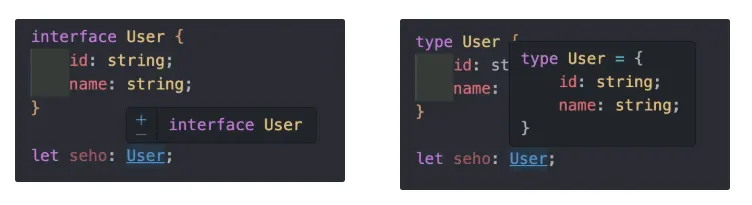
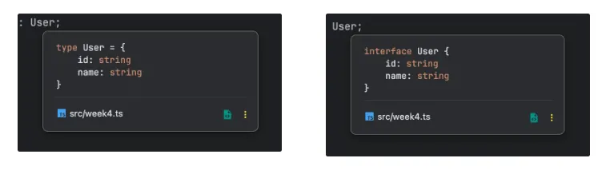

</br>
</br>

### 타입 별칭이란?

타입 별칭은 특정 타입이나 인터페이스 등을 참조할 수 있는 타입 변수를 의미합니다.

자바스크립트의 변수처럼 해당 타입이 어떤 역할을 하는지 이름을 짓고 싶을때 사용할 수도 있고, 여러 번 반복되는 타입을 변수화해서 쉽게 표기하고 싶을 때도 사용합니다.

즉, 타입에 의미를 부여해서 별도의 이름으로 부르는 것입니다.

</br>
</br>

**어떤 상황에서 타입 별칭을 사용할까?**

다음 코드와 같이 함수와 변수에 같은 타입을 사용하는 상황이 있습니다.

```tsx
function logText(text: string | number) {
	// ...
}

let message: string | number = "안녕하세요";
logText(message);
```

`string | number` 타입이 반복되는 것을 볼 수 있습니다.

앞으로 함수를 호출하기 위해 더 많은 변수가 필요할 수도 있을 텐데, 그때마다 `string | number` 타입을 반복해서 입력 한다면 코드가 길어질 것입니다.

이렇게 반복되는 코드를 타입 별칭으로 줄일 수 있습니다.

</br>
</br>

`type` 키워드를 사용하여 타입 별칭을 만들어줍니다.

```tsx
type Name = string;
let myname: Name = '은현';
```

`string` 타입을 받는 `Name` 변수를 `type` 키워드를 사용하여 타입 별칭을 만들어줍니다.

</br>
</br>

문제가 발생했던 상황을 타입 별칭을 이용하여 해결해봅시다.

```tsx
type MyMessage = string | number;

function logText(text: MyMessage) {
	// ...
}

let message: MyMessage = "안녕하세요";
logText(message);
```

`string | number` 타입을 `MyMessage` 라는 타입 별칭으로 정의하고 `logText` 함수와 `message` 변수에 지정합니다.

이렇게 타입 별칭을 사용하면 타입에 의미를 담아 여러 곳에 재사용할 수 있습니다.

</br>
</br>

### 타입 별칭과 인터페이스의 차이점

타입 별칭으로도 다음과 같이 객체 타입을 정의할 수 있고 인터페이스도 객체 타입을 정의할 수 있습니다.

```tsx
type User = {
	id: string;
	name: string;
}

interface User {
	id: string;
	name: string;
}
```

</br>
</br>

**코드 에디터에서 표기 방식 차이**

타입을 정의하고 사용하는 관점에서 가장 먼저 쉽게 구분되는 점은 코드 에디터에 표시되는 정보입니다.

VSCode 사용시 타입 별칭을 이용하는 방법이 구체적으로 어떤 모양인지 파악할 때 좋습니다.

그럼 무조건 타입 별칭만 사용하는 것이 좋을까요?

- **VSCode**



- **WebStorm**



</br>
</br>

**사용할 수 있는 타입의 차이**

타입 별칭과 인터페이스를 구분 짓는 또 다른 차이점은 정의할 수 있는 타입 종류에 있습니다.

인터페이스는 주로 객체의 타입을 정의하는 데 사용하는 반면, 타입 별칭은 일반 타입에 이름을 짓는 데 사용하거나 유니언 타입, 인터섹션 타입등에도 사용할 수 있습니다.

</br>
</br>

```tsx
type ID = string;
type Product = Tshirt | Shoes;
type Teacher = Person & Adult;
```

이런 타입들은 인터페이스로 정의할 수 없습니다.

</br>
</br>

```tsx
type Gilbut<T> = {
	book: T;
}

type MyBeer = Pick<Beer, 'brand'>;
```

타입 별칭은 제네릭이나 유틸리티 타입 등 다양한 타입에 사용할 수 있습니다.

</br>
</br>

```tsx
interface Person {
	name: string;
	age: number;
}

type Adult = {
	old: boolean;
}

type Teacher = Person & Adult;
```

인터페이스와 타입 별칭의 정의를 함께 사용할 수도 있습니다.

</br>
</br>

**타입 확장 관점에서 차이**

타입 확장이란 이미 정의되어 있는 타입들을 조합해서 더 큰 의미의 타입을 생성하는 것을 의미합니다.

타입 별칭과 인터페이스는 타입을 확장하는 방식이 다릅니다.

</br>
</br>

인터페이스는 타입을 확장할 때 상속이라는 개념을 이용합니다.

```tsx
interface Person {
	name: string;
	age: number;
}

interface Developer extends Person {
	skill: string;
}

let joo: Developer = {
	name: '은현',
	age: 25,
	skill: "프론트엔드 개발"
};
```

`extends` 라는 키워드를 사용해서 부모 인터페이스의 타입을 자식 인터페이스에 상속해서 사용할 수 있습니다.

</br>
</br>

타입 별칭은 인터섹션 타입으로 객체 타입을 2개 합쳐서 사용할 수 있습니다.

```tsx
type Person = {
	name: string;
	age: number;
}

type Developer = {
	skill: string;
}

let joo: Person & Developer = {
	name: '은현',
	age: 25,
	skill: "프론트엔드 개발"
};
```

`Person` 타입과 `Developer` 타입에 작성된 타입 정의를 `&` 연산자를 사용한 인터섹션 타입으로 합쳐 `joo` 라는 변수에는 `name`, `age`, `skill` 속성을 갖는 객체가 정의됩니다.

</br>
</br>

인터섹션 타입을 별도의 타입 별칭으로 정의하여 사용할 수도 있습니다.

```tsx
type Person = {
	name: string;
	age: number;
}

type Developer = {
	skill: string;
}

type Joo = Person & Developer;

let joo: Joo = {
	name: '은현',
	age: 25,
	skill: "프론트엔드 개발"
};
	
```

`Person & Developer` 타입을 `Joo` 라는 타입 별칭으로 정의하여 `joo` 변수에 연결했습니다.

</br>
</br>

이렇게 인터페이스와 타입 별칭 모두 타입을 확장할 수는 있지만 방식이 다릅니다.

작성된 타입을 어떻게 조합하느냐에 따라 인터페이스를 사용하기도 하고 때로는 타입 별칭을 사용할 수도 있습니다.

</br>
</br>

**선언 병합**

인터페이스는 동일한 이름으로 인터페이스를 선언하면 인터페이스 내용을 합치는 특성이 있습니다.

```tsx
interface Person {
	name: string;
	age: number;
}

interface Person {
	address: string;
}

let hyeon: Person {
	name: '은현',
	age: 25,
	address: '유성구'
};
```

첫 번째 `Person` 인터페이스에는 `name` 과 `age` 속성만 타입으로 정의한 후 두 번째 `Person` 인터페이스를 선언해서 `address` 속성의 타입을 추가합니다.

</br>
</br>

최종적으로 `hyeon` 이라는 변수에 `Person` 인터페이스를 정의하면 `Person` 인터페이스에 정의한 모든 타입을 합쳐 마치 다음과 같은 인터페이스를 정의한 효과가 나타납니다.

```tsx
interface Person {
	name: string;
	age: number;
	address: string;
}
```

이렇게 동일한 이름으로 인터페이스를 여러 번 선언했을 때 해당 인터페이스의 타입 내용을 합치는 것을 선언 병합이라고 합니다.

</br>
</br>

### 타입 별칭은 언제 쓰는 것이 좋을까?

타입 별칭으로만 타입 정의가 가능한 곳에서는 타입 별칭을 사용하고 백엔드와의 인터페이스를 정의하는 곳에서는 인터페이스를 이용하는 것이 좋습니다.

타입 별칭은 인터페이스로 정의할 수 없는 곳에는 타입 별칭을 사용합니다.

</br>
</br>

**타입 별칭으로만 정의할 수 있는 타입들**

인터페이스가 아닌 타입 별칭으로만 정의할 수 있는 타입은 주요 데이터 타입이나 인터섹션, 유니언 타입입니다.

인터페이스는 객체 타입을 정의할 때 사용하는 타입이기 때문에 다음과 같은 타입은 인터페이스를 정의할 수 없습니다.

```tsx
type MyString = string;
type StringOrNumber = string | number;
type Admin = Person & Developer;
```

</br>
</br>

타입 별칭은 제너릭, 유틸리티 타입, 맵드 타입과도 연동하여 사용할 수 있습니다.

```tsx
// 제네릭
type Dropdown<T> = {
	id: string;
	title: T;
}

// 유틸리티 타입
type Admin = { name: string; age: number; role: string; }
type OnlyName = Pick<Admin>, 'name'>

// 맵드 타입
type Picker<T, K extends keyof T> = {
	[P in K]: T[P];
};
```

제네릭은 인터페이스와 타입 별칭에 모두 사용할 수 있지만 유틸리티 타입이나 맵드 타입은 타입 별칭으로만 정의할 수 있습니다.

유틸리티 타입이나 맵드 타입은 기존에 정의된 타입을 변경하거나 일부만 활용할 때 사용합니다.

</br>
</br>

**백엔드와의 인터페이스 정의**

웹 서비스를 프론트엔드와 백엔드로 역할을 나누어서 개발할 때 백엔드에서 프론트엔드로 어떻게 데이터를 넘길지 정의하는 작업이 필요합니다.

이때 이 작업을 인터페이스를 정의한다고 흔히 말하고, 여기에서 인터페이스는 타입스크립트의 인터페이스가 아니라 영역 간 데이터를 서로 맞추는 작업을 의미합니다.

</br>
</br>

다음 예시는 사용자 정보를 받아 오는 코드이고 결과 타입도 실제로는 `AxiosPromise` 와 같은 타입을 넘겨주어야 하지만 예시를 위해 프로미스 없이 정의했습니다.

```tsx
// 타입 별칭으로 API 함수의 응답 형태를 정의
type User = {
	id: string;
	name: string;
}

function fetchData(): User {
	return axios.get('http://localhost:3000/users/1');
}

// 인터페이스로 API 함수의 응답 형태를 정의
interface User {
	id: string;
	name: string;
}

function fetchData(): User {
	return axios.get('http://localhost:3000/users/1');
}
```

타입 별칭을 사용하여 사용자 객체를 정의하거나 인터페이스를 이용해서 사용자 객체를 정의할 수도 있습니다.

</br>
</br>

타입 별칭도 좋지만 인터페이스를 이용했을 때 이점이 더 존재합니다.

서비스 요구 사항이 변경되어 화면에 노출해야 하는 데이터 구조가 바뀌었다고 했을때, 타입의 확장이라는 측면에서 인터페이스로 정의하는 것이 더 수월합니다.

```tsx
interface Admin {
	role: string;
	department: string;
}

// 상속을 통한 인터페이스 확장
interface User extends Admin {
	id: string;
	name: string;
}

// 선언 병합을 통한 타입 확장
interface User {
	skill: string;
}
```

첫 번째 `User` 인터페이스는 `Admin` 이라는 인터페이스를 상속받았기 때문에 `id`, `name`, `role`, `department` 속성을 모두 갖는 객체의 타입으로 정의됩니다.

여기에 `skill` 속성을 갖는 두 번째 `User` 인터페이스를 선언하면 인터페이스의 선언 병합 특징에 따라 최종적으로 `User` 인터페이스는 마치 다음과 같이 정의한 것처럼 동작합니다.

</br>
</br>

```tsx
interface User {
	id: string;
	name: string;
	role: string;
	department: string;
	skill: string;
}
```

이처럼 유연하게 타입을 확장하는 관점에서는 타입 별칭보다 인터페이스가 더 유리합니다.

</br>
</br>