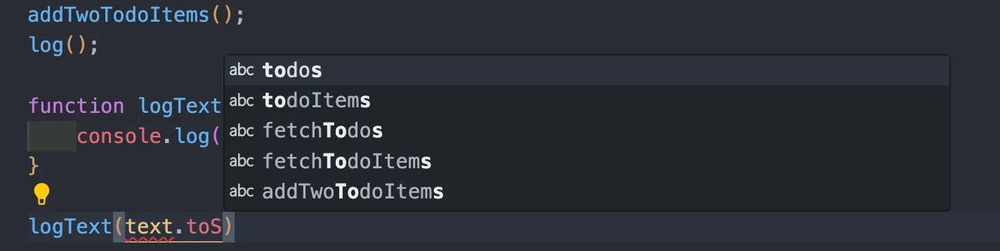
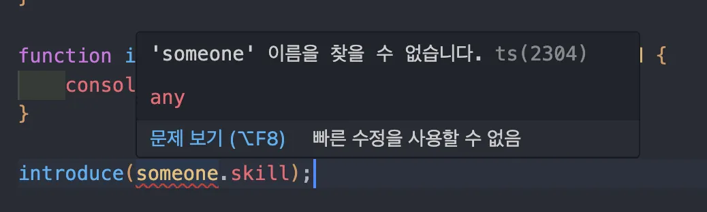
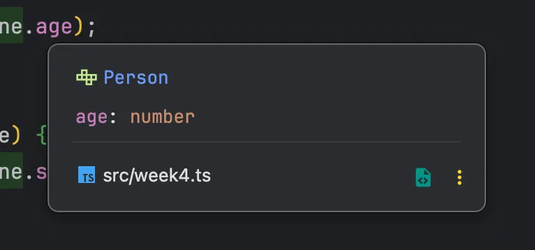
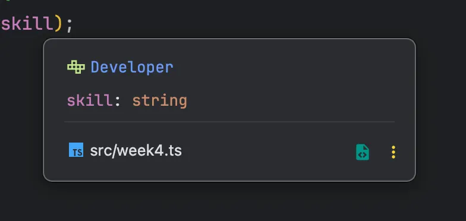
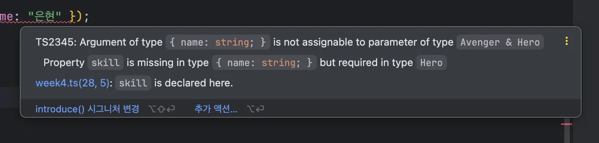

</br>
</br>

### **유니언 타입**

유니언 타입은 여러 개의 타입 중 한 개만 쓰고 싶을 때 사용하는 문법입니다.

자바스크립트의 OR 연산자인 `||`와 AND 연산자인 `&&`의 기호를 따서 타입을 정의할 수 있습니다.

```tsx
function logText(text: string | number) {
	console.log(text);
}

logText('hi'); // hi
logText(100); // 100
```

</br>
</br>

### 유니언 타입의 장점

유니언 타입을 사용하지 않았을때는 아래 코드와 같습니다.

```tsx
function logText(text: string) {
	console.log(text);
}

function logNumber(text: number) {
	console.log(text);
}
```

두개의 타입을 매개변수로 받기 위해서는 두개의 함수를 정의해야 합니다.

</br>
</br>

```tsx
function logText(text: string | number) {
	console.log(text);
}
```

유니언 타입을 사용해서 같은 동작을 하는 함수의 코드 중복을 줄일 수 있습니다.

</br>
</br>

여러 개의 타입을 받기 위해 `any` 타입을 사용하면 안될까? 라는 생각을 할 수 있습니다.

`any` 타입을 사용해도 되지만, `any` 타입은 타입이 없는 것과 마찬가지이기 때문에 타입스크립트이 장점을 살리지 못 합니다.

이때 말하는 장점은 타입이 정해져 있을 때 자동으로 속성과 API를 자동 완성하는 특성을 의미합니다.

</br>
</br>

**VSCode 기준**

VSCode는 TypeScript 타입 시스템만 기반으로 자동완성을 제공하기 때문에 `any` 타입에서는 `toString` 과 같은 기본 메서드조차 자동완성되지 않는 경우가 많습니다.



즉, 실제로 필요한 속성이나 특정 타입의 API는 타입스크립트가 추론할 수 없어 자동완성되지 않습니다.

</br>
</br>

**WebStorm 기준**

WebStorm은 `any` 타입이라도 자바스크립트 런타임 동작을 기반으로 문맥 추론을 시도하기 때문에 VSCode 보다 Object 기본 메서드 처럼 더 많은 자동완성 항목이 보여집니다.


하지만 이것은 에디터 차원의 가능성 기반 자동완성일뿐, 타입스크립트가 제공하는 타입 안정성과는 무관합니다.

결국 `any` 타입을 사용하면 VSCode든 WebStorm이든 정확한 타입 기반 자동완성의 장점을 활용하기 어렵습니다.

</br>
</br>

### 유니언 타입을 사용할 때 주의할 점

유니언 타입을 사용하면 공통 속성에만 접근할 수 있습니다.

```tsx
Person | Developer
```

해당 타입은 두 타입 중 어떤 것이 들어올지 확실하지 않다고 TypeScript가 판단합니다.

그래서 두 타입에 모두 존재하는 공통 속성만 접근하게 허용됩니다.

</br>
</br>

```tsx
interface Person {
	name: string;
	age: number;
}

interface Developer {
	name: string;
	skill: string;
}
```

공통 속성으로는 name 이 존재하고 `age` 는 `Person` 인터페이스에 `skill`은 `Developer` 인터페이스만 존재합니다.

즉, `Person | Developer` 타입에서는 `name` 만 공통 속성입니다.

</br>
</br>

`someone.age` 와 `someone.skill` 을 출력하려고 하면 다음과 같은 에러가 발생합니다.



TypeScript 입장에서는 `someone` 이 `Person` 일 수도 있고 `Developer` 일 수도 있기에 에러가 발생합니다

</br>
</br>

```tsx
interface Person {
    name: stirng;
    age: number;
}

interface Developer {
    name: string;
    skill: string;
}

function introduce(someone: Person | Developer): void {
    console.log(someone.age);
}

introduce({name: "개발자", skill: "TS"});  // undefined
```

해당 코드에 경우 `someone` 은 `Developer` 타입 객체이므로 `introduce` 함수를 실행 시켰을때 `age` 가 없기 때문에 `undefined` 가 출력됩니다.

</br>
</br>

**타입 좁히기**

위에 같은 문제를 해결하기 위해서서든 `in` 연산자를 사용하는 타입 좁히기가 필요합니다.

`in` 연산자는 객체에 특정 속성이 있는지 확인하는 자바스크립트 연산자입니다.

`in` 연산자는 객체에 해당 속성이 있으면 true를 반환하고 그렇지 않으면 false를 반환합니다.

</br>
</br>

```tsx
function introduce(someone: Person | Developer) {
  if ("age" in someone) {
    console.log(someone.age);
  }

  if ("skill" in someone) {
    console.log(someone.skill);
  }
}
```

</br>
</br>

`someone` 파라미터에 `Person` 타입의 데이터가 들어오면 `age` 속성이 있을 것이기 때문에 첫 번째 `if` 문의 결과는 `true`가 되어 `someone.age` 를 콘솔에 출력합니다.


</br>
</br>

마찬가지로 파라미터에 `Developer` 타입의 데이터가 들어오면 두 번째 `if` 문이 `true` 가 되어 `someone.skill` 이 출력됩니다.


</br>
</br>

앞서 구현하였던 `logText` 함수에 파라미터 값이 문자라면 모두 대문자로 변경해서 출력하고, 숫자라면 사용하고 있는 국가 언어에 맞추어 숫자 형식을 변경해 주는 코드를 보겠습니다.

```tsx
function logText(text: string | number) {
	if (typeof text === 'string') {
		console.log(text.toUpperCase());
	}
  if (typeof text === 'number') {
		console.log(text.toLocaleString());
	}
}
```

`typeof` 연산자를 사용하여 해당 데이터가 어떤 데이터 타입을 갖고 있는지 문자열로 반환하여 문자면 `string`, 숫자면 `number`, 함수면 `function` 등 주요 데이터 타입을 반환받습니다.

</br>
</br>

### 인터섹션 타입

인터섹션 타입은 타입 2개를 하나로 합쳐서 사용할 수 있는 타입을 말합니다.

보통 인터페이스 2개를 합치거나 타입 정의 여러 개를 하나로 합칠 때 사용합니다.

</br>
</br>

```tsx
interface Avenger {
	name: string;
}

interface Hero {
	skill: string;
}

function introduce(someone: Avenger & Hero) {
	console.log(someone.name);
	console.log(someone.skill);
}
```

해당 코드는 `name` 속성을 갖는 `Avenger` 인터페이스와 `skill` 속성을 갖는 `Hero` 인터페이스를 선언하고 `introduce` 함수의 파라미터에 인터섹션 타입인 `&` 을 사용하여 정의하였습니다.

두 인터페이스를 인터섹션 타입으로 정의했기 때문에 `someone` 파라미터에는 두 타입의 `name` 과 `skill` 속성을 모두 사용할 수 있습니다.

</br>
</br>

여기서 `name` 이나 `skill` 속성 중 하나라도 누락하여 객체를 넘긴다면 에러가 발생합니다.

```tsx
introduce({ name: "은현" });
```



`introduce` 함수의 파라미터가 `Avenger` 와 `Hero` 타입의 인터섹션 타입으로 정의되어 있기 때문에 두 타입의 모든 속성을 만족하는 객체를 인자로 넘겨야 에러가 발생하지 않습니다.

</br>
</br>