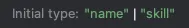
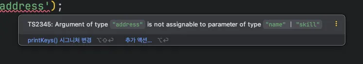
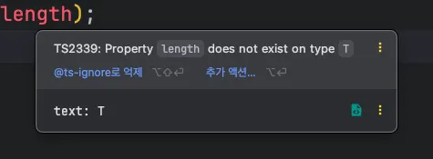

</br>
</br>
</br>
</br>

### 제네릭이란?

제네릭은 타입을 미리 정의하지 않고 사용하는 시점에 원하는 타입을 정의해서 쓸 수 있는 문법을 말합니다.

마치 함수의 파라미터와 같은 역할을 하는데, 역할이란 함수의 인자에 넘긴 값을 함수의 파라미터로 받아 함수 내부에서 그대로 사용하는 방식을 의미합니다.

</br>
</br>

```tsx
function getText(text) {
	return text;
}
```

다음 코드에서 `getText` 함수는 인자로 넘겨받은 텍스트를 그대로 반환해 줍니다.

문자열이면 문자열, 숫자면 숫자를 반환해줍니다.

이 원리를 타입스크립트에 대입해서 타입을 넘기고 그 타입을 그대로 반환받는다는 것이 바로 제네릭입니다.

</br>
</br>
</br>
</br>

### 제네릭 기본 문법

제네릭의 기본 문법은 다음과 같습니다.

```tsx
function getText<T>(text: T): T {
	return text;
}
```

먼저 함수 이름 오른쪽에 `<T>` 라고 적습니다. 이때, `<>` 은 제네릭 타입 파라미터라고 합니다.

그리고 파라미터를 닫는 괄호 오른쪽에 콜론을 붙이고 `T` 를 적습니다.

마지막으로 파라미터 타입을 `T` 로 정의하면, `getText` 함수를 실행할 때 아무 타입이나 넘길 수 있습니다.

</br>
</br>

이렇게 하면 `getText` 라는 함수를 실행할 떄 아무 타입이나 넘길 수 있습니다.

```tsx
getText<string>('hi');  // hi
```

해당 코드는 `getText` 함수를 호출할 때 제네릭에 문자열 데이터 타입인 `string` 타입을 할당합니다.

</br>
</br>

그러면 앞서 다룬 제네릭 기본 문법 코드가 마치 다음과 같이 정의된 것 같은 효과가 생깁니다.

```tsx
function getText<string>(text: string): string {
	return text;
}
```

T 라고 선언한 모든 부분에 `string` 타입이 들어간다고 보면 됩니다.

</br>
</br>

해당 코드는 궁금적으로 다음과 같이 선언된 것과 같습니다.

```tsx
function getText(text: string): string {
	return text;
}
```

함수의 파라미터인 `text` 는 `string` 타입이고, 함수의 반환 타입 역시 `string` 입니다.

</br>
</br>

제네릭에 `string` 이 아닌 `number` 타입을 넘겼다면 다음과 같이 정의된 것 같은 효과가 생깁니다.

```tsx
function getText(text: number): number {
	return text;
}
```

마찬가지로 `boolean`, `array`, `object` 등 어느 타입이든 `getText` 함수를 호출할 때 타입을 지정해서 사용할 수 있습니다.

</br>
</br>
</br>
</br>

### 왜 제네릭을 사용할까?

앞서 제네릭의 기본 개념과 문법을 살펴보았습니다.

그렇다면 왜 제네릭을 배워야 할까요?

</br>
</br>


**중복되는 타입 코드의 문제점**

제네릭을 사용하면 반복되는 타입 코드를 줄여줍니다.

문자열을 받아 그대로 반환해 주는 함수와 숫자를 받아 그대로 반환해 주는 함수를 작성한다고 가정합시다.

```tsx
function getText(text: string): string {
	return text;
}

function getText(text: number): number {
	return text;
}
```

이 두 함수는 함수의 역할과 동작은 같은데 타입이 다르기 때문에 함수를 분리해서 문자열 텍스트용 함수와 숫자 텍스트용 함수를 선언해 주었습니다.

결국 같은 동작을 하는 코드를 중복해서 선언한 꼴입니다.

</br>

→ `any` 를 쓰면 되는거 아니야?

`any` 를 사용하면 코드 중복을 해결할 순 있지만, 앞서 살펴본 any 타입을 사용했을떄에 문제점인 타입스크립트의 코드 자동 완성이나 에러의 사전 방지 혜택을 받이 못합니다.

하지만 제네릭을 사용하면 추론을 통해 타입이 정확하게 지정되면서 타입스크립트의 이점을 모두 가져갈 수 있습니다.

</br>
</br>
</br>
</br>


### 인터페이스에 제네릭 사용하기

제네릭은 함수뿐만 아니라 인터페이스에도 사용할 수 있습니다.

</br>
</br>

다음과 같이 인터페이스가 2개 있다고 생각해봅시다.

상품 목록과 상품의 재고를 보여 주는 드롭다운 UI를 인터페이스로 정의한  코드입니다.

```tsx
interface ProductDropdown {
	value: string;
	selected: boolean;
}

interface StockDropdown {
	value: number;
	selected: boolean;
}
```

여기에서 `value` 에 다른 데이터 타입을 갖는 드롭다운 UI가 필요하면 어떻게 해야 할까요?

</br>
</br>


다음과 같이 추가적으로 새로운 인터페이스를 정의해 주어야 합니다.

```tsx
interface AddressDropdown {
	value: { city: string; zipCode: string };
	selected: boolean;
}
```

이런 식으로 모든 데이터 타입을 일일이 정의한다면 타입 코드가 많아져서 관리도 어렵고 번거로운 작업이 될 것입니다.

</br>
</br>

이때 다음과 같이 제네릭을 쓸 수 있습니다.

```tsx
interface Dropdown<T> {
	value: T;
	selected: boolean;
}
```

인터페이스 이름 오른쪽에 `<T>` 를 붙여 주고 인터페이스의 내부 속성 중 제네릭을 받은 타입을 사용할 곳에 `T` 를 연결합니다.

이렇게 하면 타입을 유연하게 확장할 수 있을 뿐만 아니라 비슷한 역할을 하는 타입 코드를 대폭 줄일 수 있습니다.

</br>
</br>


이제 앞서 살펴본 여러 `Dropdown` 인터페이스 대신 `Dropdown` 인터페이스 하나로 타입을 정의할 수 있습니다.

```tsx
let product: Dropdown<string>;
let Stock: Dropdown<number>;
let Address: Dropdown<{ city: string; zipCode: string }>;
```

이처럼 인터페이스에도 제네릭을 사용하여 타입을 유연하게 확장할 수 있습니다.

</br>
</br>
</br>
</br>

### 제네릭의 타입 제약

제네릭의 타입 제약은 제네릭으로 타입을 정의할 때 좀 더 정확한 타입을 정의할 수 있게 도와주는 문법입니다.

`extends`, `keyof` 등 새로운 키워드를 사용하여 타입을 제약하는 방법을 알아봅시다.

</br>
</br>

**`extends` 를 사용한 타입 제약**

제네릭의 장점은 타입을 미리 정의하지 않고 호출하는 시점에 타입을 정의해서 유연하게 확장할 수  있다는 점이었습니다.

유연하게 확장한다는 것은 타입을 별도로 제약하지 않고 아무 타입이나 받아서 쓸 수 있다는 의미입니다.

</br>
</br>

다음 코드를 먼저 봅시다.

```tsx
function embraceEverything<T>(thing: T): T {
	return. thing;
}
embraceEverything<string>('hi');
embraceEverything<number>(100);
embraceEverything<boolean>(false);
embraceEverything<{ name: string }>({ name: 'hyeon' });
```

해당 코드에서 모든 타입이 아니라 몇 개의 타입만 제네릭으로 받고 싶다면 어떻게 해야 할까요?

</br>
</br>

먼저 제네릭으로 문자열 타입만 받을 수 있도록 `extends` 키워드을 사용해서 제네릭을 제약해봅시다.

제네릭을 선언하는 부분에 `<T extends 타입>` 과 같은 형태로 코드를 작성하면 됩니다.

```tsx
function embraceEverything<T extends string>(thing: T): T {
	return thing;
}
```

제약할 타입은 `string` 이기 때문에 `<T extends string>` 으로 정의했습니다.

</br>
</br>

이렇게 하면 해당 함수를 호출할 때 제네릭에 `string` 타입을 넘길 수 있습니다.

```tsx
embraceEverything<string>('hi');
```

만약 `string` 이 아닌 다른 타입을 제네릭으로 넘기려고 한다면 에러가 발생합니다.

</br>
</br>
</br>
</br>

**타입 제약의 특징**

일반적으로 타입을 제약할 때는 여러 개의 타입 중 몇 개만 쓸 수 있게 제약합니다.

</br>
</br>


다음과 같이 `length` 속성을 갖는 타입만 취급하겠다고 하면 받을 수 있는 타입은 `string`, `array`, `object` 가 됩니다.

→ `string`, `array`, `object` 타입은 `length` 속성을 가지고 있기 때문입니다.

```tsx
function lengthOnly<T extends { length: number }>(value: T) {
	return value.length;
}
```

`lengthOnly` 함수는 제네릭으로 받은 타입을 파라미터에만 연결해 주었고 반환 타입에는 연결하지 않았습니다.

</br>
</br>

```tsx
lengthOnly('hi');
lengthOnly([1, 2, 3]);
lengthOnly({ title: 'abc', length: 123 );
```

해당 함수의 인자로 넘길 수 있는 데이터 타입은 `string`, `array`, `length` 속성을 갖는 객체 이렇게 세 가지입니다.

다음 코드에서 `<>` 생략한 이유는 타입스크립트가 제네릭 타입 추론을 해주기 때문입니다.

</br>
</br>

```tsx
lengthOnly(100);
```

하지만 다음과 같이 `number` 타입이나 `boolean` 등 다른 데이터 타입이 들어오면 에러가 발생합니다.

`number` 타입에는 `string` 이나 `array` 처럼 내장된 `length` 속성이 없기 때문입니다.

</br>
</br>
</br>
</br>

**`keyof` 를 사용한 타입 제약**

`keyof` 키워드는 특정 타입의 키 값을 추출해서 문자열 유니언 타입으로 변환해 줍니다.

</br>
</br>

예시 코드를 통해 알아봅시다.

```tsx
type DeveloperKeys = keyof { name: string; skill: string; }
```



`DeveloperKeys` 타입에 마우스 커서를 올리면 다음과 같이 객체의 키가 유니언 타입으로 변환되어 있는 것을 볼 수 있습니다.

</br>
</br>

제네릭 타입에 `keyof` 를 적용해봅시다.

```tsx
function printKeys<T extends keyof { name: string; skill: string; }>(value: T) {
	console.log(value);
}
```

제네릭을 정의하는 부분에 `extends` 와 `keyof` 키워드를 조합해서 `name` 과 `skill` 속성을 갖는 객체의 키만 타입으로 받겠다고 정의했습니다.

</br>
</br>

해당 함수의 제네릭은 파라미터인 `value` 에 연결되어 있기 때문에 함수를 호출할 때 넘길 수 있는 인자는 문자열 `name` 과 `skill` 입니다.



이미지에서처럼 다른 값을 넘기면 에러가 발생합니다.

이처럼 `extends` 를 이용해서 제네릭의 타입을 제약할 때 `keyof` 키워드를 함께 사용하여 타입의 제약 조건을 까다롭게 만들 수 있습니다.

</br>
</br>
</br>
</br>


### 제네릭을 처음 사용할 때 주의해야 할 사고방식

제네릭을 처음 사용할 때 가장 헷갈리는 부분은 함수 안에서 제네릭으로 받은 타입을 다룰 때입니다.

</br>
</br>

다음 코드를 통해 알아봅시다.

```tsx
function printTextLength<T>(text: T) {
	console.log(text.length);
}
```

`printTextLength` 함수는 제네릭을 선언되어 있고 별도로 타입을 제약하지 않았기 때문에 `string` 타입을 인자로 넘길 수 있습니다.

</br>
</br>

하지만 다음과 같이 에러가 발생합니다.



타입스크립트 컴파일러 관점에서는 `printTextLength` 함수에 어떤 타입이 들어올지 모르기 때문에 함부로 타입을 가정하지 않습니다.

그렇기 때문에 제네릭으로 지정된 파라미터를 다룰 때 코드 자동 완성이나 타입이 미리 정의된 효과는 얻을 수 없습니다.

→ 타입 제약 문법을 사용하여 제네릭에게 알려 해결 할 수 있습니다.

</br>
</br>
</br>
</br>
