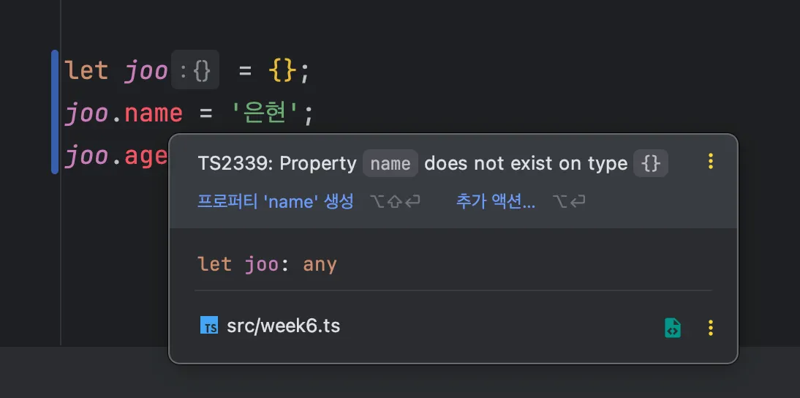
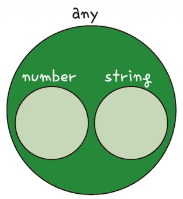
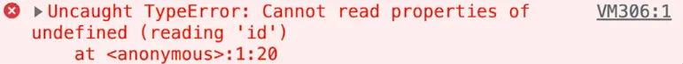

</br>
</br>

### 타입 단언이란?

타입 단언은 타입스크립트의 타입 추론에 기대지 않고 개발자가 직접 타입을 명시하여 해당 타입으로 강제하는 것을 의미합니다.

</br>

먼저, 변수를 하나 선언하고 문자열을 할당해봅시다.

```tsx
let myName = '은현';
```

타입 추론에서 배웠듯이 변수를 선언하는 시점의 초깃값으로 타입이 결정되어 `myName` 변수는 `string` 타입이 됩니다.

</br>
</br>

여기에서 `myName` 변수에 타입 단언 문법을 적용해봅시다.

`as` 라는 키워드를 이용합니다.

```tsx
let myName = '은현' as string;
```

해당 코드는 `myName` 이라는 변수의 타입을 `string` 타입으로 간주한다는 의미입니다.

`as` 키워드를 붙이면 타입스크립트가 컴파일 할 때 해당 코드의 타입 검사는 수행하지 않습니다.

</br>
</br>

다음 예시를 통해 더 알아봅시다.

```tsx
interface Person {
	name: string;
	age: number;
}

let joo = {};
```

사람을 의미하는 인터페이스 하나와 빈 객체 하나를 생성합니다.

</br>
</br>

여기에서 빈 객체에 인터페이스의 정의대로 `name` 과 `age` 속성을 추가해봅시다.



타입스크립트 컴파일러 입장에서는 해당 객체에 어떤 속성이 들어갈지 알 수 없기 때문에 다음과 같은 에러를 발생시킵니다.

</br>
</br>

다음과 같이 객체를 선언하는 시점에 속성을 정의하거나 `Person` 인터페이스로 정의하면 해결 할 수 있습니다.

```tsx
let joo = {
	name: '형주',
	age: 31
};

let joo: Person = {
	name: '형주',
	age: 31
};
```

하지만 이미 운영 중인 서비스의 코드나 누군가 만들어 놓은 코드라고 한다면 타입 에러를 해결하는 데 변경해야 할 코드가 많아집니다.

</br>
</br>

이때 타입 단언을 이용하여 기존 코드를 변경하지 않고도 타입 에러를 해결할 수 있습니다.

```tsx
let joo = {} as Person;
joo.name = '형주';
joo.age = 31;
```

변수를 선언할 때 빈 객체로 선언했지만 이 객체에 들어갈 속성은 `Person` 인터페이스의 속성이라고 타입스크립트 컴파일러에 말해 주는 것과 같은 효과를 줍니다.

빈 객체로 선언되었지만 아까와는 다르게 `joo` 타입은 `Person` 으로 간주됩니다.

</br>
</br>
</br>
</br>

### 타입 단언 문법

타입 단언 키워드인 `as` 를 이용할 수 있는 대상을 알아보고, 타입 단언을 중첩해서 사용하는 방법을 알아봅시다.

</br>

**타입 단언의 대상**

타입 단언은 숫자, 문자열, 객체 등 원시 값뿐만 아니라 변수나 함수의 호출 결과에도 사용할 수 있습니다.

함수의 파라미터 타입을 정의하지 않으면 기본적으로 모든 값을 받을 수 있도록 `any` 타입으로 추론됩니다.

```tsx
function getId(id) {
	return id;
}

let myId = getId('hyeon') as number;
```

`as` 키워드를 사용하여 함수의 호출 결과를 `number` 타입으로 단언하면 `myId` 변수의 타입이 `number` 로 추론됩니다.

</br>
</br>

**타입 단언 중첩**

타입 단언은 여러 번 중첩해서 사용할 수 있습니다.

```tsx
let num = (10 as any) as number;
```

먼저 괄호 안 코드는 숫자 10을 `any` 타입으로 단언합니다.

이 상태에서 한 번 더 `as` 키워드를 사용하여 `number` 타입으로 단언하면, `num` 변수는 `any` 타입으로 단언된 상태에서 다시 `number` 타입으로 단언되었기 때문에 최종적으로 `number` 타입이 됩니다.

</br>
</br>

**타입 단언을 사용할 때 주의할 점**

`as` 키워드는 구문 오른쪽에서만 사용해야 합니다.

또 타입 단언은 호환되지 않는 데이터 타입으로는 단언할 수 없습니다.

```tsx
let num = 10 as string;
```

`number` 타입과 `string` 타입은 타입 시스템 관점에서 교집합이 없기 때문에 단언 할 수 없습니다.

</br>
</br>



`any` 타입은 `string` 타입도 취급할 수 있고 `number` 타입도 취급할 수 있습니다.

따라서 `any` 타입은 `string` 타입 관점에서도 교차점을 갖고 있고, `number` 타입 관점에서도 교차점을 갖고 있습니다.

→ 교차점을 갖고 있다는 의미는 해당 타입으로 대체 가능하다는 의미입니다.

</br>
</br>

타입 단언은 코드를 실행하는 시점에서 아무런 역할도 하지 않기 때문에 에러에 취약한 측면이 있습니다.

서버에서 프로필을 하나 받아 오는 함수와 받아 온 프로필 아이디를 화면에 그리는 함수 코드를 통해 알아봅시다.

```tsx
interface Prodile {
	name: string;
	id: string;
}

function getProfile() {
	// ...
}

let myProfile = getProfile() as Profile;
runderId(myProfile.id);
```

`getProfile` 함수의 로직이 복잡하고 함수 결과는 `name` 과 `id` 속성을 갖는 객체라고 가정하겠습니다.

`as` 키워드를 사용해서 `Profile` 인터페이스 타입으로 단언하고 `myProfile` 변수에 할당했습니다.

</br>
</br>

타입 단언으로 `myProfile` 변수가 `Profile` 인터페이스로 간주되면서 `id` 속성에 접근할 수 있습니다.



하지만 코드를 실행해보면 에러가 발생합니다.

`myProfile` 변수가 객체가 아닌데 `id` 속성에 접근했기 때문입니다.

이처럼 함수의 로직과 결과 값을 제대로 확인하지 않고 `as` 로 단언했기 때문에 타입 에러는 발생하지 않지만 실제로 실행하는 시점에 에러가 발생할 수 있습니다.

</br>
</br>
</br>
</br>

### null 아님 보장 연산자

`null` 아님 보장 연산자는 `null` 타입을 체크할 때 유용하게 사용하는 연산자입니다.

타입 단언의 한 종류로 값이 `null` 이 아님을 보장합니다.

</br>

먼저 `null` 처리가 왜 중요한지부터 알아봅시다.

책 목록을 받아 순서를 랜덤으로 섞는 함수로 해당 함수를 실행하면  함수의 파라미터 `books` 에 `shuffle` 이라는 메서드가 제공되어 책 목록이 랜덤하게 뒤바뀝니다.

```tsx
function shuffleBooks(books) {
	let result = books.shuffle();
	return result;
}

shuffleBooks();
```

만약 다음과 같이 인자를 넣지 않고 호출하게 되면 에러가 발생합니다.

타입스크립트 파일이라면 인자를 넘기라고 에러라도 발생하지만 자바스크립트에서는 별다른 경고를 보여주지 않습니다.

</br>
</br>

이런 상황을 방지하고자 `null` 값 체크 코드를 사용합니다.

```tsx
function shuffleBooks(books) {
	if (books === null || books === undefined) {
	return;
	}
	
	let result = books.shuffle();
	return result;
}
```

해당 코드는 함수의 `books` 파라미터가 `null` 이거나 `undefined` 면  함수의 로직을 실행하지 않고 종료합니다.

이렇게함으로써 예상치 못한 함수의 입력 값에 대처할 수 있습니다.

</br>
</br>

이제 타입을 입혀봅시다.

```tsx
interface Books {
	shuffle: Function
}

function shuffleBooks(books: Books) {
	let result = books.shuffle();
	return result;
}
```

`Books` 라는 인터페이스를 선언하고 `shuffleBooks` 함수의 파라미터 타입으로 지정합니다.

</br>
</br>

만약 `shuffleBooks` 함수의 인자로 `null` 값도 들어올 수 있다고 하면 파라미터 타입을 유니언 타입으로 바꿔야합니다.

```tsx
function shuffleBooks(books: Books | null) {
	let result = books.shuffle();
	return result;
}
```

해당 코드는 `books` 파라미터에 `null` 값이 들어올 수도 있기 때문에 `books.shuffle` 코드가 위험하다고 경고를 표시합니다.

</br>
</br>

`null` 체크 로직을 넣는 것이 번거롭고 값이 `null` 이 아니라는 확신이 있다면 다음과 같이 `null` 아님 보장 연산자 `!` 를 사용합니다.

```tsx
function shuffleBooks(books: Books | null) {
	let result = books!.shuffle();
	return result;
}
```

`books` 파라미터의 `shuffle` 메서드를 호출하기 직전에 `!` 연산자를 붙이면 `books` 파라미터는 `null` 이 아니다와 동일합니다.

하지만 타입 관점에서 `null` 이 아니라고 보장하는 것이지 실행 중 실제로 `null` 값이 들어오면 에러가 발생합니다.

</br>
</br>