</br>
</br>


### 타입 추론

타입 추론이랑 타입스크립트가 코드를 해석하여 적절한 타입을 정의하는 동작을 의미합니다.

</br>
</br>

다음과 같이 변수를 하나 선언하고 값을 할당하면 해당 변수의 타입은 자동으로 추론됩니다.

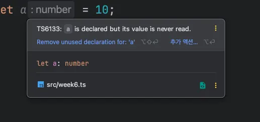

`a` 변수에 마우스 커서를 올리면 이와 같이 `number` 라고 타입이 지정되어 있는 것을 볼 수 있습니다.

</br>
</br>

다음 코드처럼 변수를 선언하면서 타입을 지정한 것과 효과가 같습니다.

```tsx
let a: number = 10;
```

이렇게 변수를 초기화하거나 함수의 파라미터에 기본값을 설정하거나 반환값을 설정했을 때 지정된 값을 기반으로 적당한 타입을 제시하고 정의해 주는 것을 타입 추론이라고 합니다.

</br>
</br>
</br>
</br>

### 변수의 타입 추론 과정

변수의 타입 추론 과정을 살펴봅시다.

먼저 `a` 변수에 값을 할당하지 않고 선언을 먼저 해봅시다.

`a` 변수에 마우스 커서를 올리면 다음과 같이 `any` 타입으로 추론됩니다.

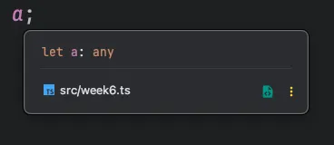

`a` 변수가 선언되는 시점에 값이 할당되지 않아 어떤 값이 들어올지 모릅니다.

따라서 어떤 값이든 받을 수 있게 타입스크립트가 모든 타입을 의미하는 `any` 타입으로 지정한 것을 볼 수 있습니다.

</br>
</br>

다음과 같이 변수를 선언한 이후에 값을 변경하면 타입이 해당 데이터에 맞는 타앱으로 변경되지 않습니다.

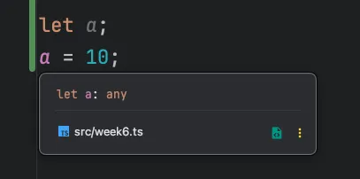

이처럼 동작하는 이유는 단순합니다.

코드를 1줄씩 해석해야 하는 타입스크립트 입장에서는 `let a;` 이후에 어떤 코드가 올지 `let a;` 가 선언되는 시점에는 알 수 없습니다.

이처럼 변수 타입은 선언하는 시점에 할당된 값을 기반으로 추론됩니다.

</br>
</br>
</br>
</br>

### 함수의 타입 추론 - 반환 타입

함수의 반환 타입 추론을 살펴봅시다.

</br>
</br>

변수의 타입 추론 과정과 마찬가지로 함수도 주어진 입력 값에 따라 함수의 반환 타입이 추론됩니다.

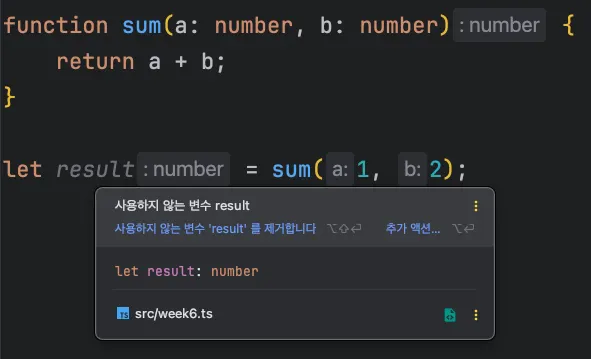)

`result` 변수의 타입이 `number` 로 추론되는 이유는 바로 `sum` 함수의 반환 타입이 `number` 타입으로 추론되기 때문입니다.

</br>
</br>

두 숫자를 받아서 더하지 않고 다음과 같이 비교하면 어떻게 될까요?

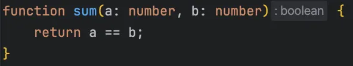

`==` 는 값 2개가 같은지 비교하는 비교 연산자입니다.

값이 같다면 `true`, 다르면 `false` 를 반환하기 때문에 반환 타입은 `boolean` 이 됩니다.

</br>
</br>
</br>
</br>

### 함수의 타입 추론 - 파라미터 타입

함수의 파라미터 타입 추론을 알아봅시다.

</br>
</br>

함수의 파라미터 타입을 지정하지 않으면 기본 타입은 `any` 가 됩니다.

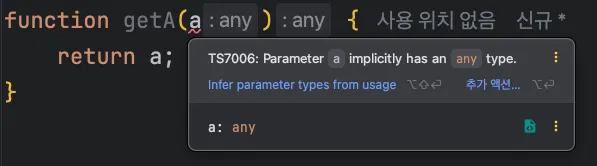

`getA` 함수는 `any` 로 지정되어 있는 파라미터를 그대로 반환해 주었기 때문에 파라미터 타입과 반환 타입이 모두 `any` 로 지정되어 있는 것을 볼 수 있습니다.

</br>
</br>

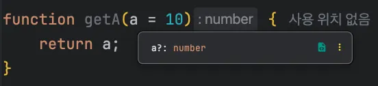

`a = 10` 은 `getA` 라는 함수를 호출했을 때 인자가 비어 있으면 `a` 에 `10` 을 할당하라는 의미입니다.

기본값이 숫자 `10` 이기 때문에 `a` 파라미터의 타입은 `number` 로 추론됩니다.

그리고 함수의 파라미터에 값을 넘기거나 넘기지 않아도 되기 때문에 옵셔널 파라미터를 의미하는 `?` 키워드가 붙습니다.

</br>
</br>

이번에는  함수 안에 변수를 선언하여 파라미터와 연산을 해봅시다.

`getA` 함수 안에 `c` 라는 변수를 선언하고 문자열 `hi` 를 할당해주었습니다.

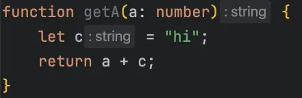

해당 변수는 함수 안에 정의되기는 햇지만 선언하면서 문자열 값을 할당했기 때문에 문자열 타입으로 추론됩니다.

여기서 반환값은 `string` 으로 나오는 이유는 자바스크립트 해석기의 동작 방식 때문입니다.

문자열과 숫자를 더할 때 자바스크립트 해석기 내부적으로 숫자를 문자열로 변환하여 문자열 2개를 합친 것과 결과가 같습니다.

</br>
</br>
</br>
</br>

### 인터페이스와 제네릭의 추론 방식

```tsx
interface Dropdown<T> {
    title: string;
    value: T;
}
```

`Dropdown` 이라는 인터페이스를 선언하고 제네릭으로 타입을 받을 수 있게 작성한 코드입니다.

제네릭으로 받은 타입은 인터페이스 속성 `value` 에 연결됩니다.

</br>
</br>

해당 인터페이스의 제네릭에 타입을 넘기면 어떻게 추론되는지 확인하기 위해 객체를 하나 선언해보았습니다.

`shoppingItem` 이라는 변수를 선언하고 `Dropdown` 인터페이스 타입으로 정의했습니다.

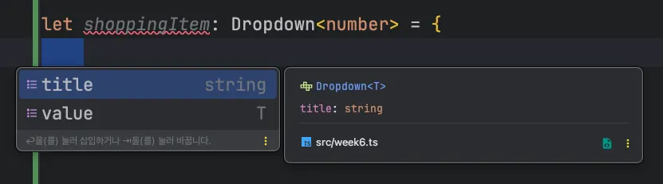

자동 완성할 수 있는 속성들을 보면 `Dropdown` 인터페이스에서 `title` 속성은 문자열 타입으로 선언했기 때문에 `string` 타입으로 추론됩니다.

`value` 속성은 제네릭 타입으로 `number` 를 넘겼기 때문에 `number` 타입으로 추론합니다.

</br>
</br>
</br>
</br>

### 복잡한 구조에서 타입 추론 방식

인터페이스에 제네릭을 2개 연결한 코드를 살펴봅시다.

</br>
</br>

`Dropdown` 인터페이스와 이 인터페이스를 상속받는 `DetailedDropdown` 인터페이스를 선언합니다.

```tsx
interface Dropdown<T> {
	title: string;
	value: T;
}

interface DetailedDropdown<K> extends Dropdown<K> {
	tag: string;
	description: string;
}
```

</br>
</br>

이제 `DetailedDropdown` 인터페이스를 사용하여 객체를 하나 정의해봅시다.

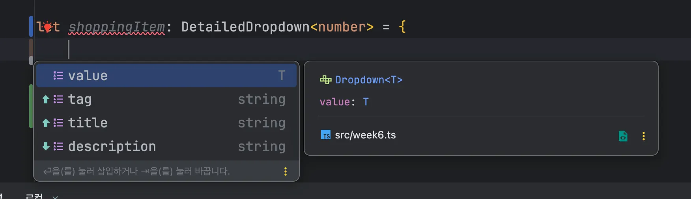

`Dropdown` 인터페이스를 상속받은 `DetailedDropdown` 인터페이스를 타입으로 정의했기 때문에 이와 같은 결과가 나옵니다.

</br>
</br>

`DetailedDropdown` 은 마치 다음 타입과 역할이 같습니다.

```tsx
interface DetailedDropdown {
	tag: string;
	description: string;
	title: string;
	value: number;
}
```

그런데 `Dropdown` 인터페이스의 `value` 속성은 왜 `number` 타입으로 추론될까요?

</br>
</br>

`DetailedDropdown` 인터페이스에 넘긴 제네릭 타입이 `Dropdown` 인터페이스의 제네릭 타입으로 전달되었기 때문입니다.

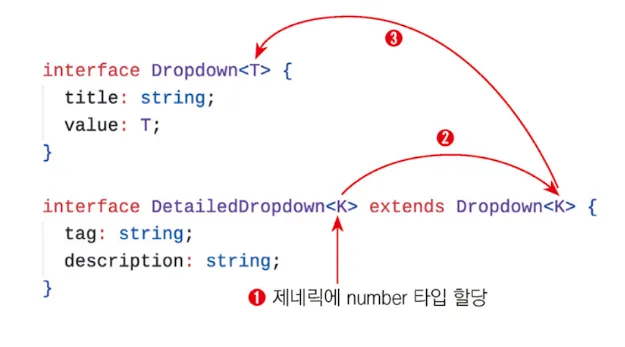

`DetailedDropdown` 인터페이스는 제네릭으로 타입을 받을 수 있게 선언했지만, 실제로 `DetailedDropdown` 인터페이스 내부에서는 제네릭으로 받은 타입을 사용하지 않습니다.

오히려 `DetailedDropdown` 의 부모 인터페이스의 제네릭 타입으로 넘겨주는 창구 역할을 하기에 `DetailedDropdown` 인터페이스를 선언할 때 제네릭 타입에 정의한 `number` 가 `Dropdown` 인터페이스의 제네릭 타입으로 전달된 것입니다.

</br>
</br>
</br>
</br>