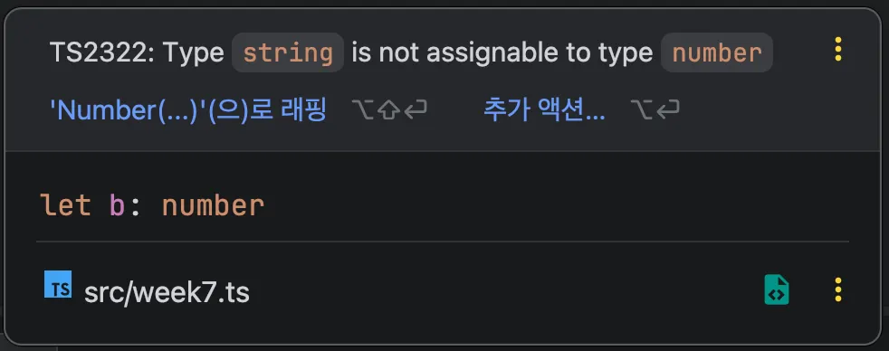
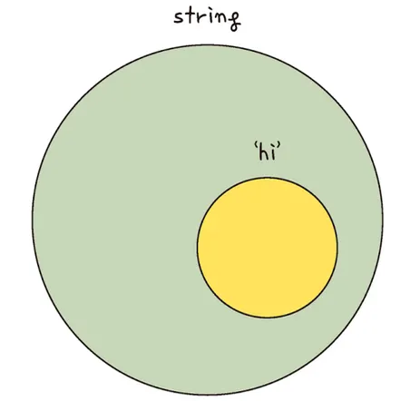
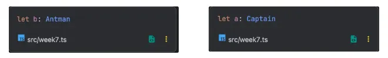
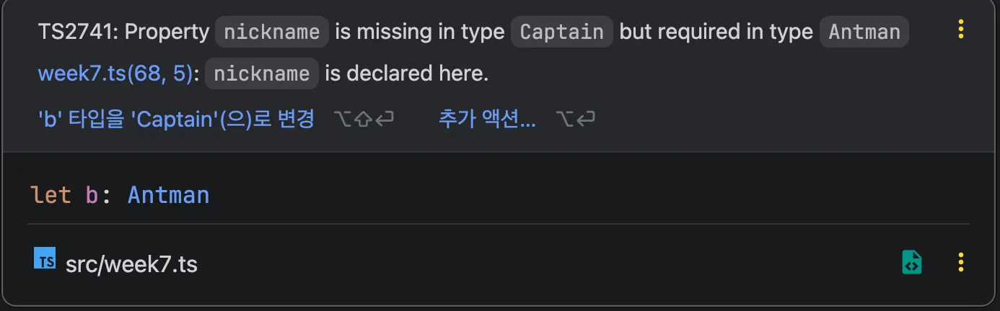
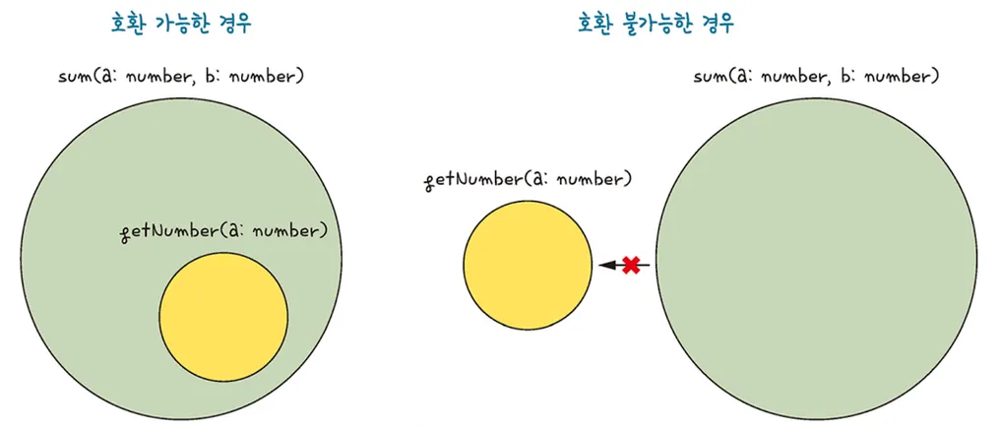
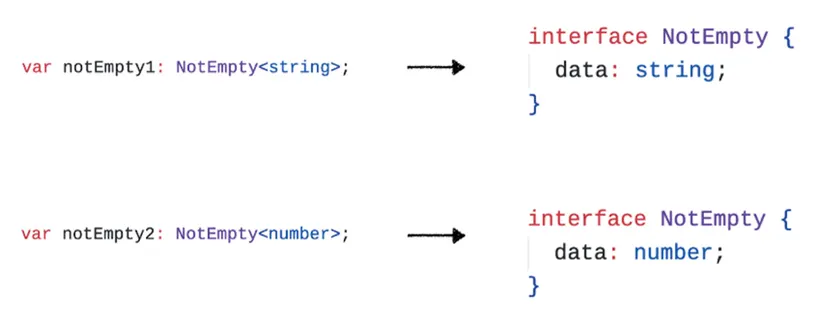

</br>
</br>

### 타입 호환이란?

서로 다른 타입이 2개 있을 때 특정 타입이 다른 타입에 포함되는지를 의미합니다.

</br>
</br>

코드로 확인해봅시다.

`a` 변수는 문자열 타입이고 `b` 변수는 숫자 타입입니다.

```tsx
let a: string = 'hi';
let b: number = 10;

b = a;
```

</br>
</br>

이렇게 선언된 변수들을 이용하여 `b - a` 라는 코드를 작성하면 다음과 같이 에러가 발생합니다.

에러 메시지에 안내되었듯이 문자열 타입은 숫자 타입에 할당할 수 없습니다.



하지만 자바스크립트에서는 미리 변수의 타입을 지정하지 않아도 실행하는 시점에 적절한 타입으로 변환해 주기 때문에 별도의 에러가 표시되지 않습니다.

이것을 타입 캐스팅이라고 합니다.

</br>
</br>

다음 코드는 이전 코드와 동일하게 `a` 변수에 문자열 타입을선언하고 `b` 변수에는 문자열 타입보다 좀 더 구체적인 `‘hi’` 문자열 타입을 지정했습니다.

```tsx
let a: string = 'hi';
let b: 'hi' = 'hi';

a = b;
```

에러가 발생하지 않았으므로 `a` 와 `b` 의 타입은 서로 호환된다고 볼 수 있습니다.

</br>
</br>

이처럼 타입 에러가 발생하지 않는 이유는 `string` 타입이 `‘hi’` 타입보다 더 큰 타입이고 `stirng` 타입이 `‘hi’` 를 포함할 수 있는 관계이기 때문입니다.



`‘hi’` 타입은 문자열 중에서도 `‘hi’` 만 받을 수 있기 때문에 `string` 타입이 받을 수 있는 무한한 개수의 문자열은 수용할 수 없습니다.

</br>
</br>
</br>
</br>

### 다른 언어와 차이점

타입스크립트의 타입 호환이라는 개념은 다른 언어와 차이가 있습니다.

코드를 통해 알아봅시다.

</br>
</br>

문자열 타입의 `name` 속성을 갖는 인터페이와 클래스를 각각 선언합니다.

`i` 변수를 선언하고 인터페이스 타입 `IronMan` 으로 지정한 후 `Avengers` 클래스를 하나 생성하여 `i` 변수에 할당했습니다.

```tsx
interface Ironman {
	name: string;
}

class Avengers {
	name: string;
}

let i: Ironman;
i = new Avengers();
```

`Avengers` 클래스가 명시적으로 `Ironman` 인터페이스를 상속받아 구현하지 않았기 때문에 에러가 발생할 것 같지만 아무 에러도 발생하지 않습니다.

이런 코드에서 타입 에러가 발생하지 않는 이유는 타입스크립트의 구조적 타이핑 특성 때문입니다.

</br>
</br>

**구조적 타이핑**

타입 유형보다는 타입 구조로 호환 여부를 판별하는 언어적 특성을 의미합니다.

다음 코드는 문자열 타입의 `name` 속성을 갖는 타입 별칭과 인터페이스를 선언합니다.

```tsx
type Captain = {
    name: string;
}

interface Antman {
    name: string;
}

let a: Captain = {
    name: '캡틴',
};

let b: Antman = {
    name: '앤트맨',
};

b = a;
```

타입 별칭과 인터페이스는 서로 다른 목적을 가진 다른 타입입니다.

하지만 타입 2개는 서로 호환됩니다.

</br>
</br>



다음 이미지처럼 `Captain` 타입 별칭을 `a` 변수에 선언하고, 인터페이스 타입인 `Antman` 을 `b` 변수에 선언한 후 `b = a` 라고 코드를 작성해도 에러가 발생하지 않습니다.


</br>
</br>

타입 호환이라는 관점에서 보았을 때 타입 별칭이 인터페이스와 호환되는지 먼저 생각해 볼 수도 있곘지만, 타입스크립트는 해당 타입이 어떤 타입 구조를 갖고 있는지로 타입 호환 여부를 판별합니다.

타입 별칭과 인터페이스는 모두 문자열 타입의 `name` 속성을 갖고 있기 때문에 타입 구조가 같다고 볼 수 있습니다.



타입 호환 여부를 판별할 때는 단순히 문자열 타입의 특정 속성 유무만 보지 않고 속성 이름까지 일치하는지 확인합니다.

다음과 같이 `Antman` 인터페이스 타입의 속성 이름을 `nickname` 으로 변경하면 에러가 발생하는 것을 볼 수 있습니다.

</br>
</br>
</br>
</br>

### 객체 타입의 호환

객체 타입은 타입 유형에 관계없이 동일한 이름의 속성을 갖고 있고 해당 속성의 타입이 같으면 호환 가능합니다.

```tsx
type Person = {
    name: string;
}

interface Developer {
    name: string;
}

let joo = Person = {
    name: '형주'
};

let capt: Developer = {
    name: '캡틴'
};

capt = joo;
joo = capt;
```

해당 코드는 `Person` 타입 별칭과 `Developer` 인터페이스가 모두 동일한 이름의 속성을 갖고 있고, 해당 속성 타입이 같이 때문에 호환 가능합니다.

두 타입 간 동일한 타입을 가진 속성이 1개라도 있으면 호환 가능합니다.

</br>
</br>

`Developer` 인터페이스에 `skill` 이라는 속성을 추가로 정의합니다.

`capt` 변수를 `joo` 변수에 할당해도 `Developer` 타입이 `Person` 타입에 호환되기 때문에 타입 에러가 발생하지 않습니다.

```tsx
type Person = {
    name: string;
}

interface Developer {
    name: string;
    skill: string;
}

let joo = Person = {
    name: '형주'
};

let capt: Developer = {
    name: '캡틴'
    skill: '방패 던지기'
};

joo = capt;
```

`Developer` 타입에 `skill` 속성이 하나 더 선언되어 있지만 `Person` 타입 입장에서는 호환하는 데 필요한 조건인 문자열 타입의 `name` 속성이 정의되어 있기 때문에 호환되는 것으로 간주합니다.

객체 타입은 인터페이스, 타입 별칭 등 타입 유형이 아니라 최소한의 타입 조건을 만족했는지에 따라 호환 여부가 판별됩니다.

</br>
</br>
</br>
</br>

### 함수 타입의 호환

함수 타입도 구조적 타이핑 관점에서 함수 구조가 유사하면 호환됩니다.

`add` 와 `sum` 함수는 모두 파라미터를 2개 정의했고, 각 파라미터는 `number` 타입으로 정의했습니다.

```tsx
let add = (a: number, b: number) => {
    return a +b;
}

let sum = (x: number, y: number) => {
    return x +y;
}

add = sum;
sum = add;
```

두 함수를 다음과 같이 할당해 보면 문제없이 할당되는 것을 볼 수 있습니다.

</br>
</br>

호환되지 않는 경우도 살펴봅시다.

구조가 다른 두 함수를 선언한 코드입니다.

```tsx
let getNumber = (num: number) => {
		return num;
};

let sum = (x: number, y: number) => {
	  return x +y;
}

getNumber = sum;
```

`getNumber` 함수에 `sum` 함수를 할당하면 에러가 발생합니다.

함수의 파라미터가 2개인 `sum` 함수를 함수의 파라미터가 1개인 `getNumber` 함수에 할당했기 때문에 함수 역할이 달라져 에러가 발생한 것 입니다.

</br>
</br>

반대로 파라미터가 더 많이 정의된 함수에 파라미터가 더 적은 함수를 할댕해봅시다.

```tsx
let getNumber = (num: number) => {
    return num;
};

let sum = (x: number, y: number) => {
    return x +y;
}

sum = getNumber;
```

`sum` 함수에 `getNumber` 함수를 할당하면 타입 에러가 발생하지 않습니다.

</br>
</br>

함수의 타입 호환은 기존 함수 코드의 동작을 보장해 줄 수 있는가라는 관점에서 이해하는 것이 좋습니다.



특정 함수 타입의 부분 집합에 해당하는 함수는 호환되지만, 더 크거나 타입을 만족하지 못하는 함수는 호환되지 않습니다.

</br>
</br>
</br>
</br>

### 이넘 타입의 호환

이넘 타입은 값 여러 개를 하나로 묶어서 사용해야 할 때 활용되는 타입입니다.

```tsx
enum Language {
		C,
		Java,
		TypeScript
}
```

이넘 값은 별도의 속성 값을 정의하지 않으면 첫 번째 속성부터 숫자 0 값을 갖고 1씩 증가돱니다.

</br>
</br>

숫자형 이넘은 숫자와 호환됩니다.

숫자 타입의 `a` 변수를 선언하고 초깃값으로 `10` 을 할당한 후 `Language` 이넘의 첫 번째 속성 `C` 를 할당합니다.

```tsx
enum Language {
		C,
		Java,
		TypeScript
}

let a: number = 10;
a = Language.C;
```

이넘 속성의 값을 숫자형 변수에 할당해도 다음과 같이 에러가 발생하지 않습니다.

</br>
</br>

다음 코드는 `langC` 변수를 선언하고 이넘 `Language` 타입의 `C` 속성을 타입으로 선언했습니다.

```tsx
enum Language {
		C,
		Java,
		TypeScript
}

enum Programming {
		C,
		Java,
		TypeScript
}

let langC: Language.C;
langC = Programming.C;
```

이넘 타입은 같은 속성과 값을 가졌더라고 이넘 타입 간에는 서로 호환되지 않습니다.

그렇기에 `langC` 변수에 이넘 `Programming` 의 속성 `C` 를 할당하면 타입 에러가 발생합니다.

</br>
</br>
</br>
</br>

### 제네릭 타입의 호환

제네릭으로 받은 타입이 해당 타입 구조에서 사용되었는지에 따라 결정됩니다.

다음 코드는 `Empty` 라는 빈 인터페이스를 선언하고 제니릭으로 타입을 념겨받을 수 있게 정의합니다.

제네릭으로 받은 타입이 `Empty` 인터페이스의 타입 구조에 전혀 영향을 미치지 않습니다.

```tsx
interface Empty<T> {

}

let empty1: Empty<string>;
let empty2: Empty<number>;
```

`empty1`, `empty2` 변수가 각각 `string` 과 `number` 라는 다른 타입을 넘겼으니 호환되지 않을 것이라고 생각할 수 있지만 두 타입은 서로 호환됩니다.

즉, 제네릭으로 받은 타입이 해당 타입 구조에서 사용되지 않는다면 타입 호환에 영향을 미치지 않습니다.

</br>
</br>

다음 코드는 인터페이스 타입 정의만 바꿔, 제네릭으로 받은 타입을 `data` 라는 속성의 타입으로 사용하도록 정의했습니다.

```tsx
interface NotEmpty<T> {
		data: T,
	}
	
let notEmpty1: NotEmpty<string>;
let notEmpty2: NotEmpty<number>;
```

인터페이스에 `string` 과 `number` 타입을 각각 넘겨서 `notEmpty1` 과 `notEmpty2` 변수를 정의했습니다.

</br>
</br>

두 변수에 각각 `string` 과 `number` 를 제네릭 타입으로 넘기게 되면 인터페이스의 타입 구조가 다음과 같이 달라져 에러가 발생합니다.



결과적으로 `notEmpty1` 변수의 타입과 `notEmpty2` 변수의 타입 구조가 다르기 때문에 서로 타입이 호환되지 않습니다.

제네릭의 타입 호환 여부를 살펴볼 때는 제네릭으로 받은 타입이 해당 타입 구조 내에서 사용되었는지 확인하면 됩니다.

</br>
</br>