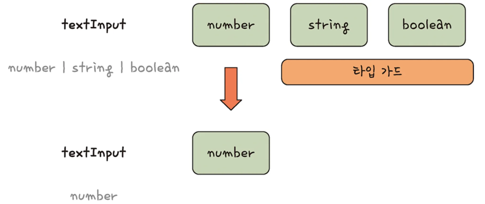
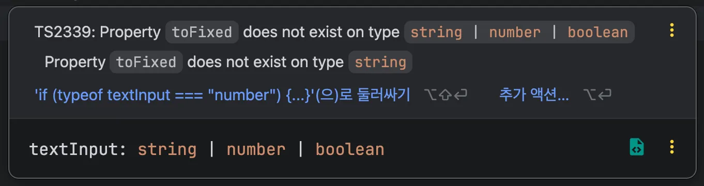
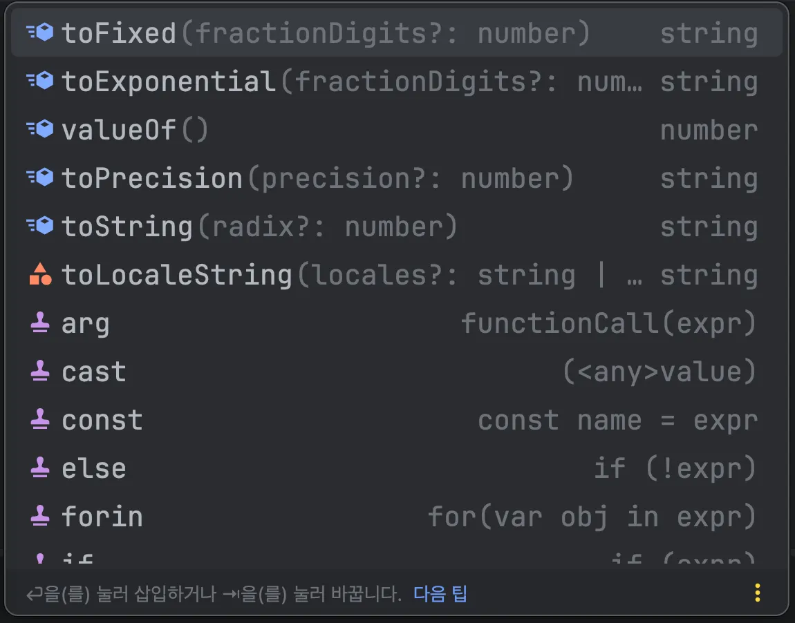
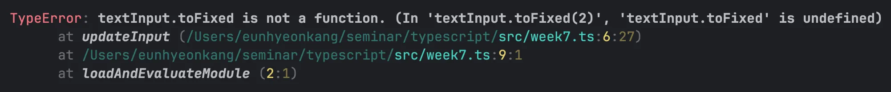
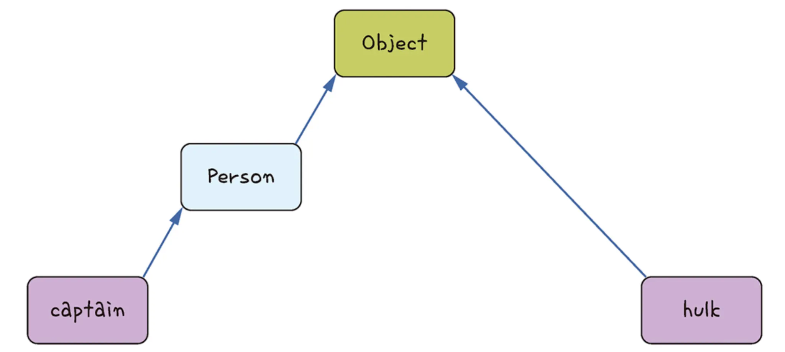
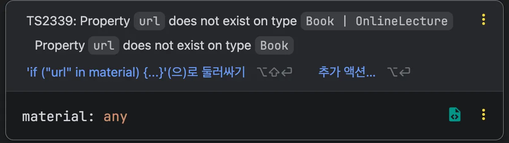
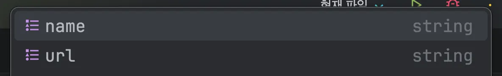
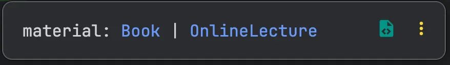
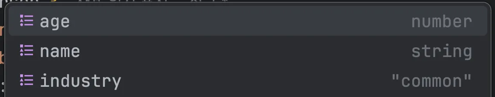

</br>
</br>


### 타입 가드란?

여러 개의 타입으로 지정된 값을 특정 위치에서 원하는 타입으로 구분하는 것을 말합니다.

타입 시스템 관점에서는 넓은 타입에서 좁은 타입으로 타입 법위를 좁힌다는 의미로 볼 수 있습니다.

</br>
</br>

아래 그림은 `textInput` 이라는 값이 `number | string | boolean` 의 유니온 타입으로 정의되어 있습니다.



해당 타입에 타입 가드를 적용하여 number 타입으로 구분하면 마치 `number | sring | boolean` 타입에서 `string` 과 `boolean` 타입을 막고 `number` 타입만 뽑아낸 것과 같습니다.

타입 가드를 사용하면 특정 위치에서 여러 개의 타입 중 하나의 타입으로 걸러 낼 수 있습니다.

</br>
</br>
</br>
</br>


### 타입 가드의 필요성

타입 가드의 필요성을 코드를 통해 알아봅시다.

</br>
</br>

다음 코드에서 `textInput` 파라미터는 `number`, `string`, `boolean` 의 유니언 타입입니다.

```tsx
function updateInput(textinput: number | string | boolean) {
	textInput.toFixed(2);
}
```

따라서 함수 안에서 `textInput` 파라미터에 접근하면 유니온 타입으로 추론됩니다.

</br>
</br>


`updateInput` 함수에 숫자를 넘겨 소수점 두 자리까지만 표기하는 `toFixed` 내장 API를 사용하면 다음과 같은 에러가 발생합니다.



`textInput` 파라미터에 지정된 유니온 타입에서 모두 사용할 수 있는 속성과 API만 접근해야 하는데 그렇지 않아 발생합니다.

</br>
</br>

**타입 단언으로 타입 에러 해결하기**

다음과 같이 textInput 파라미터의 타입을 `number` 로 강제합니다.

```tsx
function updateInput(textInput: number | string | boolean) {
	(textInput as number).toFixed(2);
}
```

이렇게 코드를 작성하면 타입 에러가 발생하지 않습니다.

</br>
</br>

`as` 키워드를 사용해서 `textInput` 의 타입을 `number` 로 단언했기 때문에 기존 타입 에러가 사라질 뿐만 아니라 `number` 타입의 API 목록도 볼 수 있습니다.



이렇게 하면 타입 에러는 해결되지만 두 가지 문제가 발생합니다.

</br>
</br>

**타입 단언으로 해결했을 때 문제점**

첫 번째 문제점은 실행 시점의 에러는 막을 수 없습니다.

타입 단언은 실제 실행 에러를 방지해 주지 않습니다.

```tsx
function updateInput(textInput: number | string | boolean) {
	(textInput as number).toFixed(2);
}

updateInput('hello');
```



`updateInput` 함수 안에 문자열이 들어왔을 때의 대비가 되어 있지 않아 실행 에러가 발생합니다.

결국 에러를 해결하려면 또 다른 코드를 추가해야 합니다.

</br>
</br>

두 번째 문제점은 타입 단언을 계속해서 사용해야합니다.

다음 코드는 숫자 API인 `toFixed` API를 사용하려고 `number` 로 한 번 타입을 단언하고, 문자열 속성인 `length` 속성에 접근하려고 `string` 타입을 한 번 더 단언했습니다.

```tsx
function updateInput(textInput: number | string | boolean) {
	(textInput as number).toFixed(2);
	console.log((textInput as string).length);
}
```

매번 특정 타입으로 인식시킬 때 `as` 키워드를 사용하여 타입을 단언하는 코드를 작성해야 합니다.

</br>
</br>
</br>
</br>

### 타입 가드로 문제점 해결

타입 가드를 사용하면 함수 안에서 타입별로 나누어 로직을 작성할 수 있습니다.

</br>
</br>

다음 코드의 첫 번째 `if` 문 안의 `textInput` 타입은 `number`, 두 번째 `if` 문 안의 `textInput` 타입은 `string` 입니다.

```tsx
function updateInput(textInput: number | string | boolean) {
	if (typeof textInput === 'number') {
		textInput.toFixed(2);
		return;
	}
	
	if (typeof textInput === 'string') {
		console.log(textInput.length);
		return;
	}
}
```

이렇게 하면 `updateInput(1.0334)` 를 호출하거나 `updateInput(’hello’)` 를 호출해도 실행할 때 에러가 발생하지 않습니다.

</br>
</br>
</br>
</br>


### 타입 가드 문법

타입 가드에 사용하는 주요 연산자는 다음과 같습니다

- `typeof`
- `instanceof`
- `in`

</br>
</br>

**`typeof` 연산자**

`typeof` 연산자는 자바스크립트 연산자입니다.

```tsx
typeof 10;              // 'number' 
typeof 'hello'          // string
typeof functuon() {}    // 'function'
```

`typeof` 연산자는 특정 코드의 타입을 문자열 값으로 반환해줍니다.

</br>
</br>


`if` 문이 타입 가드 역할을 한다고 했는데, 실질적으로 타입 가드 역할을 하는 코드는 `typeof` 연산자입니다.

```tsx
function printText(text: string | number) {
	if (typeof text === 'string') {
		// 해당 블록 안에서는 string 타입으로 간주
	}
	
	if (typeof text === 'number') {
		// 해당 블록 안에서는 number 타입으로 간주
	}
}
```

타입에 맞게 특정 로직을 실행하게끔 `if` 문과 `typeof` 연산자를 조합한 것입니다.

`typeof` 연산자를 사용하여 특정 위치에서 원하는 타입으로 구분할 수 있습니다.

</br>
</br>

**`instanceof` 연산자**

`instanceof` 연산자도 `typeof` 연산자와 마찬가지로 자바스크립트 연산자입니다.

변수가 대상 객체의 프로토타입 체인에 포함되는지 확인하여 `true/false` 를 반환해 줍니다.

```tsx
function Person(name, age) {
	this.name = name;
  this.age = age;
}

let eunhyeon = new Person('은현', 25);

eunhyoen instanceof Person;  // true

let hulk = { name: '헐크', age: 79};
hulk instanceof Person;  // false
```

`eunhyeon` 변수는 `Person` 생성자 함수의 인스턴스이기 때문에 `true` 값이 반환됩니다.

하지만 연관성이 없는 객체에 `instanceof` 연산자를 사용하면 `false` 값을 반환됩니다.

</br>
</br>

두 변수의 프로토타입 체인은 다음과 같습니다.



모든 객체는 기본적으로 `Object` 를 프로토타입으로 상속받기 때문에 `hulk` 변수의 프로토타입은 `Object` 가 되고, `eunhyeon` 변수는 생성자 한수로 생성된 객체이기 때문에 프로토타입이 `Person` 이 됩니다.

</br>
</br>

`instanceof` 연산자를 사용하여 타입 가드로 활용해봅시다.

다음 코드는 `fetchInfoByProfile` 함수의 파라미터에 `Person` 클래스와 `string` 타입을 유니언 타입으로 선언했습니다.

```tsx
class Person {
	name: string;
	age: number;
	
	constructor(name, age) {
		this.name = name;
		this.age = age;
	}
}

function fetchInfoByProfile(profile: Person | string) {
	if (profile instanceof Person) {
		// 해당 블록 안에서는 profile의 타입이 Person 타입으로 간주
	}
} 
```

`if` 문 블록 안에서는 `profile` 이 `Person` 타입으로 추론되기 때문에 `Person` 타입의 `name` 과 `age` 속성에 접근할 수 있습니다.

이처럼 `instanceof` 연산자는 주로 클래스 타입이 유니언 타입으로 묶여 있을 때 타입을 구분하기 위해 사용합니다.

</br>
</br>

**`in` 연산자**

`in` 연산자도 마찬가지로 자바스크립트 연산자입니다.

객체에 속성을 확인해주며, 특정 속성이 있으면 `true`, 그렇지 않으면 `false` 를 반환합니다.

```tsx
let book = {
	name: '타입스크립트',
	rank: 1
};

console.log('name' in book); // true
console.log('address' in book); // false
```

</br>
</br>

다음 코드는 `Book` 과 `OnlineLecture` 인터페이스 2개를 선언하고, `learnCourse` 함수를 1개 선언했습니다.

```tsx
interface Book {
	name: string;
	rank: number;
}

interface OnlineLecture {
	name: string;
	url: string;
}

function learnCourse(material: Book | OnlineLecture) {
	material.url;  // 아래 이미지와 같은 에러가 발생
}
```



별도의 타입 가드가 없다면 다음과 같은 타입 에러가 발생합니다.

</br>
</br>

`in` 연산자를 사용하여 접근을 해봅시다.

```tsx
function learnCourse(material: Book | OnlineLecture) {
	if ('url' in material) {
		material. // 아래 이미지처럼 속성을 미리볼 수 있음
	}
}
```



`url` 속성이 있는 타입은 `OnlineLecture` 밖에 없으므로 `if` 문 안에서 `material` 파라미터의 타입은 `OnlineLecutre` 타입으로 추론됩니다.

`in` 연산자를 사용하여 인터페이스 2개가 유니온 타입으로 연결되어 있을 때 특정 인터페이스로 구분할 수 있습니다.

</br>
</br>

만약 두 인터페이스의 공통 속성을 `in` 연산자로  체크하면 어떻게 될까요?

```tsx
function learnCourse(material: Book | OnlineLecture) {
	if ('name' in material) {
		material. 
	}
}
```



공통 속성은 특정 타입으로 구분해주지 않아, 타입 가드 역할을 하지 못합니다.

</br>
</br>
</br>
</br>


### 타입 가드 함수

타입 가드 역할을 하는 함수를 의미합니다.

주로 객체 유니언 타입 중 하나를 구분하는 데 사용하며, `in` 연산자와 역할은 같지만 좀 더 복잡한 경우에도 사용할 수 있습니다.

</br>
</br>

타입 가드 함수는 `is` 연산자를 사용하여 여러 개의 탕비 중 하나로 구분합니다.

```tsx
function isPerson(someone: Person | Developer): someone is Perosn {
	// ...
}
```

다음 코드는 `Person` 타입과 `Developer` 타입 중 `Person` 타입으로 구분하는 타입 가드 함수입니다.

**타입 가드 함수 예시**

</br>
</br>

간단한 코드로 살펴봅시다.

다음 코드는 `in` 연산자를 사용하여 타입 가드를 적용한 예시입니다.

```tsx
interface Person {
	name: string;
	age: number;
}

interface Developer {
	name: string;
	skill: string;
}

function greet(someone: Person | Developer) {
	if ("age" in someone) {
		console.log("사람의 나이는", someone.age);
	} else {
		console.log("개발자의 스킬은", someone.skill);
	}
}
```

</br>
</br>

다음 코드에 `isPerson` 이라는 타입 가드 함수를 정의하여 사용해봅시다.

```tsx
interface Person {
	name: string;
	age: number;
}

interface Developer {
	name: string;
	skill: string;
}

function isPerson(someone: Person | Developer): someone is Person {
	return (someone as Person).age !== undefined;
}

function greet(someone: Person | Developer) {
	if (isPerson(someone)) {
		console.log("사람의 나이는", someone.age);
	} else {
		console.log("개발자의 스킬은", someone.skill);
	}
}
```

타입 단언 키워드인 `as` 를 사용하여 `Person` 타입으로 추론을 강제한 후 `age` 속성에 접근합니다.

그리고 `age` 속성이 있는지 없는지를 `!== undefined` 로 체크합니다.

마지막으로 함수의 반환 타입을 `is` 연산자를 사용하여 `someone` 파라미터가 `Person` 타입인지 체크합니다.

</br>
</br>

타입 가드 연산자 `in` 과 역할이 달라 보이지 않는데, 왜 굳이 함수로 정의해서 사용해야할까?

```tsx
interface Hero {
	name: string;
	nickname: string;
}

interface Person {
	name: string;
	age: number;
}

interface Developer {
	name: string;
	age: string;
	skill: string;
}

function greet(someone: Hero | Person | Developer) {
	if ('age' in someone) {
		console.log(someone.age);
	}
}
```

`greet` 함수에서 `age` 속성은 `string` 과 `number` 의 유니언 타입이기 때문에 `someone` 파라미터는 Person 타입이 아닌 `Person` 과 `Developer` 의 유니온 타입으로 추론됩니다.

</br>
</br>

이러한 문제점을 해결하기 위해 인자로 받은 객체의 `age` 속성 타입이 `number` 면 `Person` 타입이라고 구분해 주는 타입 가드 함수를 넣어봅시다.

```tsx
interface Hero {
	name: string;
	nickname: string;
}

interface Person {
	name: string;
	age: number;
}

interface Developer {
	name: string;
	age: string;
	skill: string;
}

function isPerson(someone: Hero | Person | Developer): someone is Person {
	return typeof (someone as Person).age === 'number';
}

function greet(someone: Hero | Person | Developer) {
	if (isPerson(someone)) {
		console.log(someone.age);
	}
}
```

이제 `if` 문 안에 `someone` 파라미터는 `Person` 타입으로 추론되기 때문에 `age` 속성의 타입이 `number` 타입이 됩니다.

이처럼 타입 가드 함수를 사용하면 여러 가지 타입이 얽혀 있을 때 쉽게 타입을 구분할 수 있습니다.

</br>
</br>
</br>
</br>

### 구별된 유니언 타입

유니언 타입을 구성하는 여러 개의 타입을 특정 속성의 유무가 아니라 특정 속성 값으로 구분하는 타입 가드 문법을 의미합니다.

특정 타입에 속성이 있는지 없는지를 걸러 내주는 `in` 연산자와는 다르게 특정 속성 값으로 구분됩니다.

```tsx
interface Person {
	name: string;
	age: number;
	industry: 'common';
}

interface Developer {
	name: string;
	age: string;
	industry: 'tech';
}

function greet(someone: Person | Developer) {
	if (someone.industry === 'common') {
		// someone의 타입은 Person 타입으로 추론
	}
}
```



`someone` 의 타입이 `Perosn` 타입으로 추론되어 `age` 타입이 `number | string` 유니온 타입이 아닌 `number` 타입으로 추론되는 것을 확인할 수 있습니다.

이처럼 속성 유무가 아니라 속성의 문자열 타입 값을 비교해서 타입을 구분해 내는 것이 구별된 유니언 타입입니다.

</br>
</br>