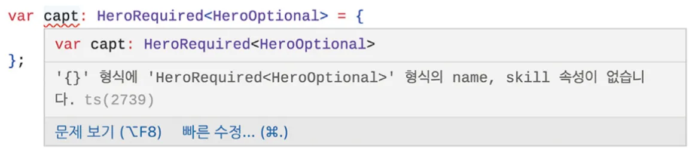

</br>
</br>

### 맵드 타입이란?

이미 정의된 타입을 가지고 새로운 타입을 생성할 때 사용하는 타입 문법을 의미합니다.

앞서 배운 유틸리티 타입은 모두 내부적으로 맵드 타입을 이용해서 구현되었습니다.

</br>
</br>

### **맵드 타입 첫 번째 예시: in**

다음 코드는 `HeroNames` 타입에 맵드 타입 문법을 적용하여 `HeroAttendance` 라는 새로운 타입을 정의합니다.

```tsx
type HeroNames = 'capt' | 'hulk' | 'thor';

type HeroAttendance = {
	[Name in HeroName]: boolean;
};
```

`HeroAttendance` 타입은 영웅 이름을 속성 이름으로 하고 `boolean` 값을 속성 값으로 정의합니다.

</br>
</br>

`HeroAttendance` 의 타입은 다음과 같습니다.

```tsx
type HeroAttendance = {
	capt: boolean;
	hulk: boolean;
	thor: boolean;
}
```

다음과 같이 이미 정의된 타입으로 새로운 타입을 생성하려면 `[Name in HeroName]` 형태의 문법을 사용해야 합니다.

</br>
</br>
</br>
</br>

### map() API로 이해하는 맵드 타입

`map()` API는 자바스크립트 배열에서 사용할 수 있는 내장 API 입니다.

`map()` API는 특정 배열의 각 요소를 변환하여 새로운 배열로 만들어 줍니다.

</br>
</br>

다음 코드는 1, 2, 3 을 요소로 갖는 `arr` 배열에 `map()` API를 적용하여 새로운 `doubledArr` 배열을 생성합니다.

`map()` API는 이와 같이 인자로 함수를 하나 넘기고 각 요소를 어떻게 변환할지 정의합니다.

```tsx
let arr = [1, 2, 3];

let doubledArr = arr.map(function(num) {
	return num * 2;
});

console.log(doubledArr); // [2, 4, 6]
```

이 코드에서는 각 요소에 `* 2` 를 했으므로 `arr` 배열의 요소가 각각 2배가 된 [2, 4, 6]이 생성됩니다.

`map()` API의 특징은 기존 배열 값을 변경하지 않고 새로운 배열을 생성합니다.

따라서 `map()` API 를 실행한 `arr` 배열의 값은 변하지 않습니다.

</br>
</br>

앞서 살펴본 맵드 타입 예시를 `map()` API로 비슷하게 구현해 봅시다.

맵드 타입은 타입을 변환하는 것이고 `map()` API는 실제 값을 변환합니다.

```tsx
let heroes = ['capt', 'hulk', 'thor'];

let heroAttendance = heroes.map(function(hero) {
	return {
		[hero]: true
	}
});
```

배열에 `map()` API를 사용하여 이름을 키로 갖고 출석 여부를 값으로 갖는 객체로 변환했습니다.

</br>
</br>

새로 정의된 `heroAttendance` 배열을 마치 다음과 같이 정의된 것과 같습니다.

```tsx
let heroAttendance = [
	{ capt: true },
	{ hulk: true },
	{ thor: true }
];
```

이처럼 맵드 타입이나 `map()` API나 기존에 정의된 타입 또는 값을 변환하여 새로운 타입 또는 값을 생성한다는 점에서 성격이 동일합니다.

</br>
</br>
</br>
</br>

### 맵드 타입 두 번째 예시: keyof

이번에는 문자열 유니언 타입으로 새로운 타입을 생성하는 것이 아니라 기존에 정의된 타입 일부분을 맵드 타입으로 변경해봅시다.

다음 코드는 `name` 과 `skill` 속성을 갖는 `Hero` 인터페이스에 맵드 타입을 적용하여 각 속성의 유무를 나타내는 `HeroPropCheck` 타입을 선언합니다.

```tsx
interface Hero {
	name: string;
	skill: string;
}

type HeroPropCheck = {
	[H in keyof Hero]: boolean;
};
```

</br>
</br>

`HeroPropCheck` 타입의 정보는 다음과 같습니다.

```tsx
type HeroPropCheck = {
	name: boolean;
	skill: boolean;
}
```

맵드 타입을 적용하여 `string` 에서 `boolean` 으로 바뀐 것과 같은 효과가 나타납니다.

맵드 타입을 적용했기 때문에 `Hero` 인터페이스의 타입 정의를 바꾸는 것이 아니라 `HeroPropCheck` 라는 새로운 타입을 생성한 것입니다.

</br>
</br>

`keyof` 는 특정 타입의 키 값만 모아 문자열 유니언 타입으로 변환해 주는 키워드입니다.

```tsx
interface Hero {
	name: string;
	skill: string;
}

type HeroNames1 = keyof Hero;
type HeroNames2 = 'name' | 'skill';
```

`HeroNames1` 타입과 `HeroName2` 타입은 같은 타입입니다.

`HeroNames1` 는 `Hero` 인터페이스의 키인 `name` 과 `skill` 속성을 문자열 유니언 타입으로 변환한 타입입니다.

`HeroNames2` 는 `keyof Hero` 의 결과를 일일이 나열했습니다.

</br>
</br>

`HeroPropCheck` 에 적용을 해봅시다.

```tsx
interface Hero {
	name: string;
	skill: string;
}

type HeroPropCheck = {
	[H in keyof Hero]: boolean;
};

type HeroPropCheck = {
	[H in 'name' | 'skill']: boolean;
};
```

두 타입 모두 같은 역할을 합니다.

이처럼 맵드 타입을 이용하면 문자열 유니온 타입을 이용하여 객체 형태의 타입을 변환할 수 있을 뿐만 아니라, 객체 형태의 타입에서 일부 타입 정의만 변경한 새로운 객체 타입을 정의할 수 있습니다.

</br>
</br>
</br>
</br>

### 맵드 타입을 사용할 때 주의할 점

인덱스 시그니처 문법 안에서 사용하는 `in` 앞의 타입 이름은 개발자 마음대로 지을 수 있습니다.

```tsx
typeHeroNames = 'capt' | 'hulk' | 'thor';

// #1
type HeroAttendance = {
	[Name in HeroNames]: boolean;
};

// #2
type HeroAttendance = {
	[heroName in HeroNames]: boolean;
};

// #3
type HeroAttendance = {
	[name in HeroNames]: boolean;
};
```

`in` 뒤에 오는 타입은 이미 정의되어 있기 타입이기 때문에 `HeroNames` 로 고정되고, `in` 앞에 오는 타입 변수는 순회할 타입 변수이므로 마음대로 작명할 수 있습니다.

</br>
</br>

그 다음은 맵드 타입의 대상이 되는 타입 유형입니다.

문자열 유니언 타입, 인터페이스 외에도 타입 별칭으로 정의된 타입도 맵드 타입으로 변환할 수 있습니다.

```tsx
// 인터페이스 타입으로 맵드 타입을 생성
interface Hero {
	name: string;
	skill: string;
}

type HeroPropCheck = {
	[H in keyof Hero]: boolean;
};

// 타입 별칭으로 맵드 타입을 생성
type Hero = {
	name: string;
	skill: string;
};

type HeroPropCheck = {
	[H in keyof Hero]: boolean;
};
```

`Hero` 인터페이스든 타입 별칭 `Hero` 든 모두 동일하게 `HeroPropCheck` 타입에서 활용될 수 있습니다.

</br>
</br>

다음과 같은 경우에는 맵드 타입을 사용할 수 없습니다.

```tsx
type Login = boolean;

type LoginAuth = {
	[L in Login]: string;
};
```

객체의 속성 이름은 문자, 숫자 등으로 선언할 수 있고 `true`, `false` 형태의 `boolean` 타입으로는 선언할 수 없기 때문에 타입 에러가 발생합니다.

</br>
</br>
</br>
</br>

### 매핑 수정자

맵드 타입으로 타입을 변환할 때 속성 성질을 변환할 수 있도록 도와주는 문법입니다.

매핑 수정자는 `+`, `-`, `?`, `readonly` 등이 있습니다.

</br>
</br>

`?` 매핑 수정자를 먼저 봅시다.

다음 코드는 `Hero` 타입에 맵드 타입과 매핑 수정자를 적용하여 `Hero` 속성을 모두 옵션 속성으로 변환합니다.

```tsx
type Hero = {
	name: string;
	skill: string;
};

type HeroOptional = [
	[H in keyof Hero]?: string;
};
```

</br>
</br>

`HeroOptional` 타입 정보는 다음과 같은 구조를 갖습니다.

```tsx
type HeroOptional = {
	name?: string;
	skill?: string;
}
```

이처럼 맵드 타입을 사용할 때 속성에 `?` 또는 `readonly` 등을 붙여 타입 성질을 바꿀 수 있습니다.

</br>
</br>

매핑 수정자를 사용하면 옵션 속성 `?` 나 `readonly` 등 일반 속성 이외에 추가된 성질을 모두 제거할 수 있습니다.

다음 코드는 앞서 `?` 매핑 수정자로 생성한 타입을 보기 편하게 정의합니다.

```tsx
type HeroRequired<T> = {
	[Property in keyof T]-?: t[Property];
};

let capt: HeroRequired<HeroOptional> = {
	name: '캡틴',
	skill: '방패 던지기'
};
```

해당 코드에서 `HeroRequried` 타입은 먼저 제네릭으로 받아 해당 타입을 이용하여 맵드 타입으로 변환해주면서 속성 선언 부분에 `-?` 를 붙여 주었습니다.

이렇게 하면 제네릭 타입으로 받은 속성의 옵션 속성을 모두 제거하여 필수 속성으로 만듭니다.

</br>
</br>

속성 선언 부분에 타입 변수 이름을 `Property` 로 짓고 속성 값의 타입을 `T[Property]`로 정의하여 제네릭으로 넘겨 받은 타입의 속성 이름과 속성 값 타입이 그대로 연결되도록 선언했습니다.

`HeroRequired<HeroOptional>`  타입의 속성이 모두 필수 값인지 확인하기 위해 `capt` 변수의 내용을 전부 지우면 다음 에러가 발생합니다.



이처럼 `-` 매핑 수정자를 이용하여 옵션 속성을 필수 속성으로 변환하거나 `readonly` 속성을 일반 속성으로 변환할 수 있습니다.

반대로 `+` 매핑 수정자는 옵션 속성을 추가합니다.

</br>
</br>
</br>
</br>

### 맵드 타입으로 직접 유틸리티 타입 만들기

지금까지 배운 맵드 타입을 이용하여 타입스크립트의 내장 유틸리티 타입을 구현해봅시다.

객체 타입 속성을 모두 옵션 속성으로 바꾸어 주는 `Partial` 타입을 구현해봅시다.

```tsx
interface Todo {
	id: string;
	title: string;
}

type OptionalTodo = Partial<Todo>;
```

</br>
</br>

`Partial` 타입을 맵드 타입과 매핑 수정자를 이용해서 만들어봅시다.

```tsx
interface Todo {
	id: string;
	title: string;
}

type MyPartial = {
	[Property in keyof Todo]?: Todo[Property];
};
```

다음 코드는 `Todo` 인터페이스의 키 속성을 모두 순회하면서 각 속성을 모두 `?` 를 이용해서 옵션 속성으로 변환합니다.

`MyPartial` 타입은 `Partial<Todo>` 코드와 동일한 타입입니다.

</br>
</br>

하지만 다른 객체 타입에 `Partial` 타입 효과를 적용하려면 또 다시 구현해 주어야 합니다.

```tsx
type MyPartial<Type> = {
	[Property in keyof Type]?: Type[Property];
};
```

특정 객체 타입에 일일이 `Partial` 타입 역할을 하는 코드를 중복해서 작성하지 않고 어떤 타입이 오든 `Partial` 타입 효과를 동일하게 적용할 수 있도록 다음과 같이 `MyPartial` 타입 코드를 바꾸어 볼 수 있습니다.

</br>
</br>

따라서 `Person` 인터페이스, `Todo` 인터페이스 혹은 타입 별칭 `Hero` 등 어떤 타입이 오더라도 동일하게 `Partial` 타입 효과를 적용할 수 있습니다.

```tsx
type TodoPartial = MyPartial<Todo>;
type PersonPartial = MyPartial<Person>;
type HeroPartial = MyPartial<Hero>;
```

이렇게 되면 `MyPartial` 타입은 마치 타입스크립트 내장 유틸리티 타입인 `Partial` 타입과 동일한 역할을 하게 됩니다.

</br>
</br>