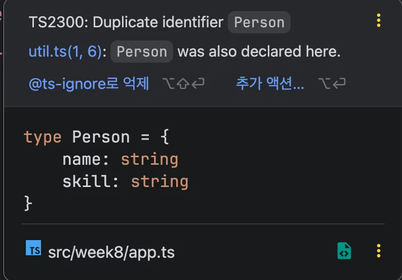

</br>
</br>

### 모듈이란?

수많은 함수와 변수, 클래스 등을 논리적인 단위로 구분하여 필요할 때 가져다 쓸 수 있는 개념을 말합니다.

즉, 특정 목적을 가지는 기능들이 모인 작은 단위의 코드를 모듈이라고 합니다.

</br>
</br>

**모듈의 필요성: 자바스크립트의 태생적 한계**

자바스크립트는 태생적으로 모듈이라는 개념이 없던 프로그래밍 언어입니다.

아래에 코드는 `a.js` 와 `b.js` 파일을 불러서 `getTotal` 함수를 실행하는 HTML 코드입니다.

```tsx
<!-- index.html -->
<body>
	<script src="a.js"></script>
	<script src="b.js"></script>
	<script>
		getTotal();
	</script>
</body>

// a.js
let total = 100;
function getTotal() {
	return total;
}

// b.js
let total = 200;
```

다음 코드는 스크립트의 로드 순서에 따라 `b.js`의 `total` 변수 값이 `a.js`의 `total` 변수 값을 덮어쓰므로 `200`이 출력됩니다.

파일별로 변수나 함수를 구분해서 정의하더라고 기본적으로 모두 전역 유효 범위를 갖는 것이 자바스크립트의 특징입니다.

전역 유효 범위는 이처럼 예상치 못한 결과를 야기합니다.

</br>
</br>

**자바스크립트 모듈화를 위한 시도들**

초창기 자바스크립트는 모듈을 지원하지 않았기에 불편함을 느낀 사용자들은 모듈화를 지원하려는 시도를 했습니다.

대표적인 두 가지가 `Common.js` 와 `Require.js` 입니다.

</br>
</br>

**Commonjs**

브라우저뿐만 아니라 브라우저 이외의 환경인 서버, 데스크톱에서도 자바스크립트를 활용하려고 고안된 스펙이자 그룹입니다.

여기서 말하는 그룹과 스펙은 문제점을 해결하기 위한 개발자들이 만든 규격입니다.

다음과 같은 문법으로 자바스크립트 모듈화를 지원합니다.

```tsx
// math.js
function sum(a, b) {
	return a + b;
}

module.exports = {
	sum
};

// app.js
let math = require('./math.js');

```

외부에서 사용할 수 있도록 `module.exports` 라는 문법을 지정해 주었습니다.

그리고 `require` 문법을 이용하여 `exports` 로 지정되어 있는 함수를 사용합니다.

이처럼 Node.js 가 설치되어 있다면 별도의 도구나 라이브러리 없이도 이와 같은 문법을 이용하여 자바스크립트의 모듈화를 실현할 수 있습니다.

</br>
</br>

**Require.js**

`Require.js` 는 `Commonjs` 와는 다르게 비동기 모듈 정의 그룹에서 고안된 라이브러리 입니다.

비동기 모듈은 필요할 때 순차적으로 해당 모듈을 가져옵니다.

```tsx
<body>
	<!-- 라이브러리 파일 다운로드 후 다음과 같이 연결 -->
	<script>
		require(["https://unpkg.com/vue@3/dist/vue.global.js"], functuon () {
			console.log('vue is loaded')
		});
	</script>
<body>
```

해당 코드는 `require` 문법을 이용하여 외부 라이브러리를 마치 모듈처럼 가져오는 형태로 사용할 수 있습니다.

</br>
</br>
</br>
</br>

### 자바스크립트 모듈화 문법

2015년 자바스크립트를 의미하는 ES6부터 `import` 와 `export` 문법을 지원합니다.

ES6는 ECMAScript 2015의 줄임말로 자바스크립트 표준을 의미합니다.

```tsx
// math.js
function sum(a, b) {
	return a + b;
}

export { sum }
```

`math.js` 파일에 `sum` 함수를 선언하고 `export` 로 해당 함수를 모듈화합니다.

</br>
</br>

`export` 로 함수를 지정했기 때문에 다른 파일에서 해당 함수를 불러와 사용할 수 있습니다.

```tsx
// app.js
import { sum } from './math.js';
console.log(sum(10, 20));
```

`import` 문법을 사용하여 `export` 한 함수를 불러옵니다.

</br>
</br>

**export default 문법**

`export` 문법은 `default` 구문을 사용할 수 있습니다.

```tsx
// math.js
function sum(a, b) {
	return a + b;
}

export default sum;
```

`export` 에 `default` 를 붙이면 해당 파일에서 하나의 대상만 내보내기에 `sum` 함수 하나만 가져 올 수 있습니다.

</br>
</br>

`import` 구문에서 `default` 로 함수를 꺼냈기 때문에 `{}` 를 붙이지 않아도 됩니다.

```tsx
// default X
import { sum } from './math.js';

// default O
import sum from './math.js';
```

이처럼 `default` 구문은 하나의 대상만 모듈에서 내보내고 싶을 때 사용합니다.

</br>
</br>

**import as 문법**

`import` 구문에 `as` 키워드를 사용하면 가져온 변수나 함수의 이름을 해당 모듈 내에서 변경하여 사용할 수 있습니다.

`import` 구문에서 사용되는 `as` 키워드는 타입 단언의 `as` 키워드와는 다르므로 사용하는 위치에 따라 주의하여 사용해야합니다.

```tsx
// math.js
function sum(a, b) {
	return a + b;
}

export { sum }

// app.js
import { sum as add } from './math.js';
console.log(add(10, 20));
```

`as` 키워드를 사용하면 `sum` 함수를 가져와 `app.js` 에서는 `add` 라는 이름으로 사용 할 수 있습니다.

`app.js` 파일에서 이름을 바꾸어 사용했다고 해서 `sum` 함수 이름 자체가 바뀌지는 않습니다.

</br>
</br>

**import * 문법**

특정 파일에서 내보낸 기능이 많아 `import` 구문으로 가져와야 할 것이 많다면 `*` 키워드를 사용하여 편리하게 가져올 수 있습니다.

```tsx
// math.js
function sum(a, b) {
	return a + b;
}

function substract(a, b) {
	return a - b;
}

function divide(a, b) {
	return a / b;
}

export { sum, substract, divide }
```

`math.js` 파일에서 `sum` 함수를 비롯한 함수를 3개를 내보냅니다.

</br>
</br>

그리고 `app.js` 파일에서 `* as myMath` 라는 문법으로 모두 가져와 사용합니다.

```tsx
// app.js
import * as myMath from './math.js'
console.log(myMath.sum(10, 20));
console.log(myMath.substract(30, 10));
console.log(myMath.divide(4, 2));
```

해당 키워드를 사용하면 `export` 키워드로 지정한 모든 변수와 함수를 `myMath` 라는 이름을 붙여서 사용합니다.

</br>
</br>

이때 `myMath` 를 객체라고 생각해도 됩니다.

```tsx
let myMath = {
	sum: function() {
		// ...
	},
	substract: function() {
		// ...
	},
	divide: function() {
		// ...
	}
};
```

이렇게 익스포트할 대상이 많거나 별도의 네임스페이스를 지정하여 사용하고 싶을 때는 `*` 키워드를 사용합니다.

</br>
</br>

**export 위치**

`export` 는 특정 파일에서 다른 파일이 가져다 쓸 기능을 내보낼 때 사용하는 키워드로 변수나 함수, 클래스에 모두 사용할 수 있습니다.

```tsx
const pi = 3.14;
const getHi = () => {
	return 'hi'
};

class Person {
	// ...
}

export { pi, getHi, Person }
```

파일의 맨 마지막 줄에 `export` 로 내보낼 대상을 정의하는 것이 관례입니다.

</br>
</br>

하지만 다음과 같이 내보낼 대상 앞에 바로 `export` 를 붙여도 상관없습니다.

```tsx
export const pi = 3.14;
export const getHi = () => {
	return 'hi'
};

export class Person {
	// ...
}
```

이와 같이 작성하면 맨 아래 줄에 별도로 `export` 구문을 추가할 필요가 없어 직관적인 부분도 있지만, 반대로 내보낼 대상이 많아지면 `export` 라는 단어를 일일이 붙여야 하기 때문에 코드 반복이 많아집니다.

</br>
</br>

섞어사용하는 방법이 가장 좋지만 React 공식문서에는 `export default` 일일이 붙여 사용하기에 해당 방식을 사용하는 것이 좋습니다.

실무에서 사용할때는 팀에서 정의된 코딩 컨벤션을 따르는게 좋습니다.

</br>
</br>
</br>
</br>

### 타입스크립트 모듈

타입스크립트의 모듈은 지금까지 배운 모듈화 개념과 문법을 그대로 적용하면 됩니다.

```tsx
// math.ts
export default function sum(a: number, b: number) {
	return a + b;
}

// app.ts
import sum from './math';
console.log(sum(10, 20));
```

</br>
</br>

타입스크립트 모듈을 다룰 때 추가로 알아야 할 점은 타입을 내보내고 가져올 수 있습니다.

```tsx
// hero.ts
export default interface Hulk {
	name: string;
	skill: string;
}

// app.ts
import Hulk from './hero';

let banner: Hulk = {
	name: '배너',
	skill: '화내기'
}
```

이처럼 자바스크립트이 변수, 함수, 클래스를 `export` 로 내보내듯이 타입스크립트의 인터페이스, 타입 별칭 등을 내보내어 사용할 수 있습니다.

</br>
</br>
</br>
</br>

### 타입스크립트 모듈 유효 범위

자바스크립트가 변수를 선언할 때 기본적으로 전역 변수로 선언되듯이 타입스크립트 역시 전역 변수로 선언됩니다.

같은 경로에 있는 `util.ts` 와 `app.ts` 를 바탕으로 이해해봅시다.

다음 코드는 `util.ts` 에 `Person` 이라는 타입 별칭을 선언하고 `app.ts` 에 해당 타입 별칭을 사용하여 `capt` 변수를 정의합니다.

```tsx
// util.ts
type Person = {
	name: string;
}

// app.ts
let capt: Person = {
	name: '캡틴'
};

type Person = {
	name: string;
	skill: string;
}
```

`capt` 변수에는 `util.ts` 파일에 선언한 `Person` 타입 별칭의 정의에 따라 `name` 속성만 정의해 주어도 정상적으로 정의됩니다.

</br>
</br>

그리고 `capt` 변수 아래쪽에 다시 `Person` 이라는 타입 별칭을 정의하면 다음과 같이 에러가 발생합니다.



타입스크립트 입장에서는 어느 파일에서 변수나 타입을 선언하든 전역 변수로 간주하기 때문에 같은 프로젝트 내에서는 이미 선언된 이름을 사용할 수 없습니다.

</br>
</br>

정리하자면 타입스크립트 파일에 `import` 나 `export` 가 하나도 없으면, 타입스크립트는 해당 파일을 전역 스코프로 간주합니다.

그렇기에 `util.ts` 에 선언한 `Person` 과 `app.ts` 에 선언한 `Person` 은 같은 공간에 있는 것으로 취급하기에 중복되었다는 에러가 발생하는 것입니다.

</br>
</br>

> **에러 표시가 안될때**
>

원래는 `export` 라는 키워드가 있어야만 모듈이 되지만, `tsconfig.json` 에서 해당 옵션을 `force` 로 설정하면 모든 파일을 무조건 모듈로 취급하기 때문에 에러가 발생하지 않습니다.

```tsx
{
  "compilerOptions": {
    "moduleDetection": "force"
  }
}
```

에러를 확인하고 싶다면 해당 옵션을 `auto` 로 수정하면 됩니다.

</br>
</br>

전역 변수로 유효 범위가 정의되어 있다 하더라고 `let` 이나 `interface` 등 재선언이나 병합 선언이 가능한 코드는 별도로 에러가 표시되지 않습니다.

다음 코드는 `util.ts` 와 `app.ts` 파일에 모두 `Person` 이라는 인터페이스를 선언하고 `capt` 변수에 지정합니다.

```tsx
// util.ts
interface Person {
	name: strng;
}

// app.ts
let capt: Person = {
	name: '캡틴',
	skill: '방패'
};

interface Person {
	name: string;
	skill: string;
}
```

두 인터페이스는 같은 이름으로 여러 개 선언되어 인터페이스의 정의가 병합됩니다.

</br>
</br>

따라서 다음과 같이 인터페이스가 정의됩니다.

```tsx
interface Person {
	name: string;
	skill: string;
}
```

그렇기 때문에 `app.ts` 파일의 `capt` 변수를 선언할 때 `name` 과 `skill` 속성을 모두 정의해 주어야 합니다.

</br>
</br>
</br>
</br>

### 타입스크립트 모듈화 문법

**import type 문법**

타입을 가져올 때도 자바스크립트 모듈과 동일하게 `import` 구문을 사용할 수 있지만, 타입 코드일 때는 `type` 이라는 키워드를 추가로 사용할 수 있습니다.

다음 코드는 `app.ts` 파일에서 `import type` 으로 `Hulk` 타입을 가져와 사용한 코드입니다.

```tsx
// hero.ts
export default interface Hulk {
	name: string;
	skill: string;
}

// app.ts
import type Hulk from './hero';

let banner: Hulk = {
	name: '배너',
	skill: '화내기',
};
```

이처럼 타입을 다른 파일에서 `import` 로 가져오는 경우 `import type` 을 사용하여 타입 코드인지 아닌지 명시할 수 있습니다.

</br>
</br>

**import inline type 문법**

`import inline type` 문법은 변수, 함수 등 실제 값으로 쓰는 코드와 타입 코드를 같이 가져올 때 사용할 수 있습니다.

여러 개를 가져올 때 어떤 코드가 타입인지 구분할 수 있는 장점이 있습니다.

```tsx
// hero.ts
export default interface Hulk {
	name: string;
	skill: string;
}

export default function smashing() {
	return '';
};

export default let doctor = {
	name: '스트레인지'
};

// app.ts
import { type Hulk, doctor, smashing } from './hero';

let banner: Hulk = {
	name: '배너',
	skill: '화내기',
};
```

`import` 구문 3개를 가져오는데, 타입인 경우 앞에 `type` 을 붙여 명시적으로 타입이라는 것을 강조해줄 수 있습니다.

이처럼 한 파일에서 `import` 로 여러 개의 값과 코드를 가져올 때 `import { type }` 형태를 이용하여 가져온 코드가 타입인지 아닌지 명시할 수 있습니다.

</br>
</br>
</br>
</br>

### 모듈화 전략 - Barrel

여러 개의 파일에서 모듈을 정의하여 가져올 때 배럴이라는 전략을 사용하는게 좋습니다.

배럴이란 여러 개의 파일에서 가져온 모듈을 마치 하나의 통처럼 관리하는 방식을 말합니다.

```tsx
// 일반적인 형태
import { Banner } from './hero/hulk';
import { Tony } from './hero/ironman';
import { Steve } from './hero/captain';

// 배럴 전략
import { Banner, Tony, Steve } from './hero';
```

일반적인 형태에 비해 배럴 전략을 사용하면 다음과 같이 단순화하여 코드 가독성을 높일 수 있습니다.