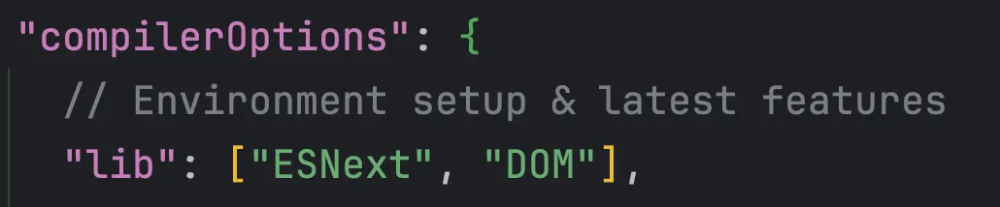

</br>
</br>

### 유틸리티 타입이란?

이미 정의되어 있는 타입 구조를 변경하여 재사용하고 싶을 때 사용하는 타입입니다.

타입스크립트에서 미리 정의해 높은 내장 타입이기 때문에 `tsconfig.json` 의 `lib` 속성만 변경해 주면 바로 사용할 수 있습니다.



`lib` 속성은 타입스크립트에서 미리 정의해 놓은 타입 선언 파일을 사용할 때 쓰는 옵션입니다.

`ESNext` 는 최신 자바스크립트 기능들의 타입, `DOM` 은 브라우저 환경의 API 타입을 포함할 수 있습니다.

</br>
</br>


다음 속성을 변경해주면 다음과 같이 유틸리티 타입이 지원되어 이미 정의되어 있는 유틸리티 타입을 활용할 수 있습니다.

```tsx
interface Profile {
	id: string;
	address: string;
}

type ProfileId = Pick<Profile, 'id'>;
```

다음 코드는 `Pick` 이라는 간단한 유틸리티 타입을 이용하여 `Profile` 인터페이스의 `id` 속성을 추출해서 새로운 타입으로 정의합니다.

</br>
</br>
</br>
</br>


### Pick 유틸리티 타입

특정 타입의 속성을 뽑아서 새로운 타입을 만들어 낼 때 사용합니다.

```tsx
interface Profile {
	id: string;
	address: string;
}

type ProfileId = Pick<Profile, 'id'>;
```

`id` 와 `address` 속성을 갖는 인터페이스의 `id` 속성을 뽑아 `ProfileId` 라는 새로운 타입을 정의합니다.

</br>
</br>

`ProfileId` 타입은 다음과 같이 타입구조를 가지게 됩니다.

```tsx
type ProfileId = {
	id: string;
};
```

</br>
</br>

`ProfileId` 타입을 이용해서 다음과 같이 `id` 속성을 갖는 객체를 정의할 수 있습니다.

```tsx
interface Profile {
	id: string;
	address: string;
}

type ProfileId = Pick<Profile, 'id'>;

let captProfile: ProfileId = {
	id: '아이디'
};
```

이처럼 `Pick` 타입으로 이미 존재하는 타입의 특정 속성만 추출해서 새로운 타입으로 정의할 수 있습니다.

</br>
</br>


`Pick` 타입으로 속성을 추출할 때 1개가 아니라 여러 개를 추출해서 타입을 정의할 수 있습니다.

```tsx
interface UserProfile {
	id: string;
	name: string;
	address: string;
}

type HulkProfile = Pick<UserProfile, 'id' | 'name'>;

let hulk: HulkProfile = {
	id: '1',
	name: '헐크',
};
```

</br>
</br>

마찬가지로 `HulkProfile` 다음과 같은 타입 구조를 가지게됩니다.

```tsx
type HulkProfile = {
	id: string;
	name: string;
}
```

</br>
</br>

**Pick 타입 문법**

정리하자면 Pick 유틸리티 타입은 다음과 같은 문법을 갖고 있습니다.

```tsx
Pick<대상 타입, '대상 타입의 속성 이름'>
Pick<대상 타입, '대상 타입의 속성 1 이름' | '대상 타입의 속성 2 이름' >
```

`Pick` 타입의 화살 괄호는 제네릭 문법으로 첫 번째로 넘긴 타입과 두 번째로 넘긴 타입으로 결과 타입이 정의되는 구조입니다.

</br>
</br>
</br>
</br>


### Omit 유틸리티 타입

특정 타입에서 속성 몇 개를 제외한 나머지 속성으로 새로운 타입을 생성할 때 사용하는 유틸리티 타입입니다.

`Pick` 타입이 특정 속성을 몇 개 뽑아서 타입을 생성하는 반면, `Omit` 타입은 특정 타입에서 속성 몇 개만 제외하고 나머지 타입으로 새로운 타입을 생성합니다.

</br>
</br>

**Omit 타입 문법**

`Omit` 을 선언한 후 첫 번째 제네릭 타입에 대상 타입을 넘기고, 두 번째 제네릭 타입으로 제외할 속성 이름을 문자열 타입 또는 문자열 유니언 타입으로 선언합니다.

```tsx
Omit<대상 타입, '대상 타입의 속성 이름'>
Omit<대상 타입, '대상 타입의 속성 1 이름' | '대상 타입의 속성 2 이름' >
```

</br>
</br>

`Omit` 타입을 적용해봅시다.

```tsx
interface UserProfile {
	id: string;
	name: string;
	address: string;
}

type User = Omit<UserProfile, 'address'>;
```

`id`, `name`, `address` 속성을 갖는 인터페이스를 하나 선언하고, `address` 속성을 제외한 나머지 속성들을 `Omit` 타입으로 새롭게 선언합니다.

</br>
</br>

`Omit` 타입을 적용한 `User` 타입은 다음과 같은 타입 구조가 됩니다.

```tsx
type User = {
	id: string;
	name: string;
}
```

</br>
</br>

**Omit 타입과 Pick 타입 비교**

`Omit` 타입과 `Pick` 타입은 정확히 반대의 역할을 합니다.

```tsx
interface UserProfile {
	id: string;
	name: string;
	address: string;
}

type User1 = Omit<UserProfile, 'address'>;
type User2 = Pick<UserProfile, 'id' | 'name'>;
```

다음 코드는 `UserProfile` 인터페이스에 `Omit` 과 `Pick` 타입을 이용하여 `id` 와 `name` 속성을 갖는 타입을 생성합니다.

</br>
</br>

생성된 `User1, 2` 타입 구조는 다음과 같이 타입 구조가 동일합니다.

```tsx
type User1 = {
	id: string;
	name: string;
}

type User2 = {
	id: string;
	name: string;
}
```

어떤 유틸리티 타입을 쓸지는 개의 취향이나 선호도에 따라 정할 수 있습니다.

결과적으로 같은 결과가 나오기 때문에 가급적이면 코드를 줄이는 방향으로 유틸리티 타입을 정해서 사용하는 것이 좋습니다.

속성 이름을 여러 개 넣지 않는 쪽이 유리하기에 다음 코드는 `Omit` 타입을 사용하는 것이 좋습니다.

</br>
</br>
</br>
</br>


### Partial 유틸리티 타입

특정 타입의 모든 속성을 모두 옵션 속성으로 변환한 타입을 생성해 줍니다.

주로 `HTTP PUT` 처럼 데이터를 수정하는 REST API를 전송할 때 종종 사용되는 타입입니다.

</br>
</br>

**Partial 타입 문법**

`Partial` 타입 문법은 대상 타입만 넘기면 됩니다.

```tsx
Partial<대상 타입>
```

</br>
</br>

`Pick` 타입, `Omit` 타입과 마찬가지로 객체 형태의 타입만 대상 타입으로 취급할 수 있습니다.

```tsx
interface Todo {
	id: string;
	title: string;
}

type OptionalTodo = Partial<Todo>;
```

</br>
</br>

`Partial` 타입을 적용한 결과인 `OptionalTodo` 타입은 다음과 같은 타입 구조를 가지게 됩니다.

```tsx
type OptionalTodo = {
	id?: string;
	title?: string;
}
```

`Todo` 인터페이스의 `id` 와 `title` 속성에 옵션 속성 표시인 옵셔널 파라미터 `?` 가 붙어 있는 것을 볼 수 있습니다.

</br>
</br>

`OptionalTodo` 타입을 이용하면 다음과 같이 `id` 와 `title` 속성을 선택적으로 적용하여 객체를 생성할 수 있습니다.

```tsx
let nothing: OptionalTodo = {};
let onlyId: OptionalTodo = { id: '아이디만' };
let onlyTitle: OptionalTodo = { title: '제목만' };
let todo: OptionalTodo = { id: '1', title: 'Partial 배우기' };
```

</br>
</br>

**Partial 타입 예시**

특정 타입의 속성을 모두 선택적으로 사용할 수 있으므로 보통 데이터 수정 API를 다룰 때 사용합니다.

`Todo` 인터페이스와 할 일 정보를 변경하여 서버에 전달해 주는  `updateTodo` 함수가 있다고 하겠습니다.

```tsx
interface Todo {
	id: string;
	title: string;
	checked: boolean;
}

function updateTodo(todo: Todo) {
	// ...
}
```

서버 쪽에서는 `id`, `title`, `checked` 속성 중 변경된 속성만 넘겨 달라고 할 수도 있고, 데이터 전체를 넘겨 달라고 할 수도 있습니다.

</br>
</br>

설계에 따라 다음과 같이 여러 방식으로 `updateTodo` 함수 파라미터의 타입을 정의해 볼 수 있습니다.

``Pick`` 과 ``Omit`` 유틸리티 타입을 이용해서 다음과 같이 정의할 수 있습니다.

```tsx
// id 속성만 넘기는 경우
function updateTodo(todo: Pick<Todo, 'id'>) {
	// ...
}

// id와 checked 속성만 넘기는 경우
function updateTodo(todo: Omit<Todo, 'checked'>) {
	// ...
}

// 할 일 데이터에 정의된 값을 모두 넘기는 경우
function updateTodo(todo: Todo) {
	// ...
}
```

</br>
</br>

`Partial` 타입을 사용하면 세 가지 케이스를 모두 만족시킬 수 있습니다.

```tsx
interface Todo {
	id: string;
	title: string;
	checked: boolean;
}

function updateTodo(todo: Partial<Todo>) {
	// ...
}

updateTodo({ id: '1' });
updateTodo({ id: '1', title: 'Partial 학습' });
updateTodo({ id: '1', title: 'Partial 학습', checked: true });
```

이처럼 `Partial` 타입은 특정 타입의 속성을 모두 옵션 속성으로 변경해 줍니다.

따라서 데이터를 수정하는 API를 호출하거나 이미 정해진 데이터 타입을 다른 곳에서 선택적으로 재사용할 때 주로 사용합니다.

</br>
</br>
</br>
</br>

### Exclude 유틸리티 타입

유니언 타입을 구성하는 특정 타입을 제외할 때 사용합니다.

앞서 살펴본 `Pick`, `Omit`, `Partial` 타입이 모두 객체 타입의 형태를 변형하여 새로운 객체 타입을 만드는 반면 `Exclude` 타입은 유니언 타입을 변형합니다.

</br>
</br>

**Exclude 타입 문법**

첫 번째 제네릭 타입에 변형할 유니언 타입을 넣고, 두 번째 제네릭 타입으로 제외할 타입 이름을 문자열 타입으로 적거나 문자열 유니언 타입으로 넣어 주면 됩니다.

```tsx
Exclude<대상 유니언 타입, '제거할 타입 이름'>
Exclude<대상 유니언 타입, '제거할 타입 이름 1' | '제거할 타입 이름 2'>
```

</br>
</br>

**Exclude 타입 예시**

다음 코드는 `C`, `Java`, `TypeScript`, `React` 문자열 타입을 유니언 타입으로 갖는 `Languages` 타입에 `Exclude` 유틸리티 타입을 적용합니다.

```tsx
type Languages = 'C' | 'Java' | 'TypeScript' | 'React';
type TrueLanguages = Exclude<Languages, 'Reat'>;
```

</br>
</br>

`Exclude` 로 `React` 타입을 제거한 `TrueLanguages` 의 타입은 다음과 같습니다.

```tsx
type TrueLanguages = "C" | "Java" | "Typescript"
```

</br>
</br>

제외할 타입을 하나가 아니라 여러 개 넘길 수 있습니다.

```tsx
type Languages = 'C' | 'Java' | 'TypeScript' | 'React';
type WebLanguages = Exclude<Languages, 'C' | 'Java' | 'React' >;
```

</br>
</br>

`TypeScript` 문자열 타입만 남겨 놓고 나머지 문자열 타입을 모두 유니언 타입으로 제외합니다.

`WebLanguage` 타입 정보를 확인해 보면 다음과 같습니다.

```tsx
type WebLanguages = "TypeScript"
```

이처럼 유니언 타입에서 특정 타입을 제거하고 싶으면 `Exclude` 타입을 사용합니다.

</br>
</br>
</br>
</br>

### Record 유틸리티 타입

타입 1개를 속성의 키로 받고 다른 타입 1개를 속성 값으로 받아 객체 타입으로 변환해 줍니다.

</br>
</br>

**Record 타입 문법**

`Record` 타입의 첫 번째 제네릭 타입에는 객체 속성의 키로 사용할 타입을 넘기고, 두 번째 타입에는 객체 속성의 값으로 사용할 타입을 넘깁니다.

```tsx
Record<객체 속성 키로 사용할 타입, 객체 속성의 값으로 사용할 타입>
```

첫 번째 제네릭 타입에는 `string`, `number`, `string` 유니언, `number` 유니언 등이 들어갈수 있습니다.

→ JavaScript의 객체 구조 설계

- 객체는 내부적으로 해시맵 구조
- 해시맵의 키는 해시 가능한 값이어야 함
- `string`, `number`, `symbol`은 원시 타입으로 불변이라 해시 키로 적합

두 번째 제네릭 타입에는 아무 타입이나 넣을 수 있습니다.

</br>
</br>

**Record 타입 첫 번째 예시**

`Record` 타입의 첫 번째 제네릭 타입으로 속성의 키 값인 `HeroNames` 타입을 넣고, 두 번째 제네릭 타입에 속성 값이 될 `HeroProfile` 타입을 넣었습니다.

```tsx
type HeroProfile = {
	skill: string;
	age: number;;
}

type HeroNames = 'thor' | 'hulk' | 'capt';

type Heroes = Record<HeroNames, HeroProfile>;
```

</br>
</br>

`Record` 타입이 적용된 `Heroes` 타입은 다음과 같은 타입을 갖습니다.

```tsx
type Heroes = {
	thor: HeroProfile;
	hulk: HeroProfile;
	capt: HeroProfile;
}
```

`Heroes` 타입의 형태는 객체고 키 값은 `HeroNames` 의 문자열 타입 `thor`, `hulk`, `capt` 입니다.

속성 값의 타입은 모두 두 번째 제네릭 타입으로 받았던 `HeroProfile` 타입의 형태를 갖습니다.

</br>
</br>

따라서 해당 `Heroes` 타입을 이용하면 다음과 같이 객체를 선언할 수 있습니다.

```tsx
type Heroes = Record<HeroNames, HeroProfile>;

let avengers: Heroes = {
	capt: {
		skill: '방패',
		age: 100
	},
	thor: {
		skill: '해머',
		
		age: 3000
	},
	hulk: {
		skill: '괴성',
		age: 47
	}
};
```

`avengers` 변수가 `Heroes` 타입의 정의에 맞게 각 속성 이름과 값이 정의된 것을 볼 수 있습니다.

</br>
</br>

**Record 타입 두 번째 예시**

다음과 같이 좀 더 단순한 형태의 데이터 타입을 활용해도 됩니다.

다음 코드는 `Record` 타입의 첫 번째와 두 번째 제네릭 타입으로 모두 문자열을 넘겨서 `PhoneBook` 이라는 타입을 생성합니다.

```tsx
type PhoneBook = Record<string, string>;
```

</br>
</br>

`PhoneBook` 타입을 확인해 보면 다음과 같이 정의되어 있습니다.

```tsx
type PhoneBook = {
	[x: string]: string;
}
```

인덱스 시그니처에 따라 문자열 키를 여러 개 정의할 수 있습니다.

</br>
</br>

인덱스 시그니처로 정의되었기 때문에 다음과 같이 키, 값을 더 넣을 수 있습니다.

```tsx
type PhoneBook = Record<string, string>;

let companyPhone: PhoneBook = {
	ceo: '010-0000-0000',
	hr: '010-0000-1111'
};
```

</br>
</br>